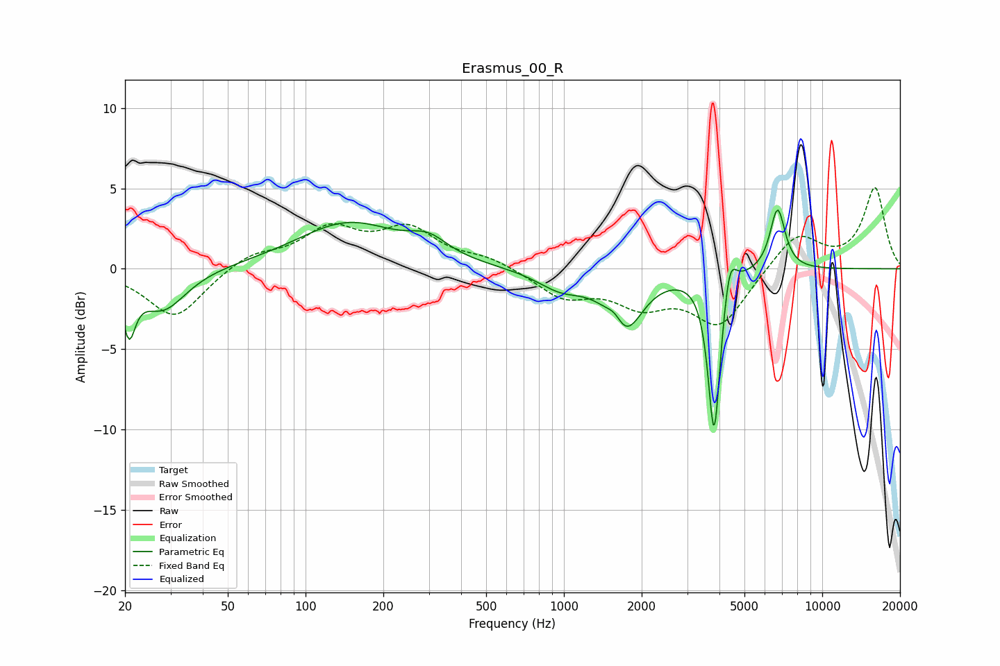

# Erasmus_00_R
See [usage instructions](https://github.com/jaakkopasanen/AutoEq#usage) for more options and info.

### Parametric EQs
Apply preamp of -3.8 dB when using parametric equalizer.

|   # | Type    |   Fc (Hz) |    Q |   Gain (dB) |
|-----|---------|-----------|------|-------------|
|   1 | Peaking |        21 | 5.97 |        -3.1 |
|   2 | Peaking |        28 | 1.56 |        -2.6 |
|   3 | Peaking |       146 | 0.71 |         2.8 |
|   4 | Peaking |       299 | 1.9  |         1.1 |
|   5 | Peaking |       975 | 1.51 |        -1.1 |
|   6 | Peaking |      1581 | 4.16 |         1.1 |
|   7 | Peaking |      1705 | 2.1  |        -4   |
|   8 | Peaking |      3816 | 6    |       -10.3 |
|   9 | Peaking |      4385 | 6    |         2.2 |
|  10 | Peaking |      6716 | 4.73 |         3.9 |

### Fixed Band EQs
When using fixed band (also called graphic) equalizer, apply preamp of **-5.1 dB** (if available) and set gains manually with these parameters.

|   # | Type    |   Fc (Hz) |    Q |   Gain (dB) |
|-----|---------|-----------|------|-------------|
|   1 | Peaking |        31 | 1.41 |        -3.1 |
|   2 | Peaking |        62 | 1.41 |         0.9 |
|   3 | Peaking |       125 | 1.41 |         2.3 |
|   4 | Peaking |       250 | 1.41 |         2.3 |
|   5 | Peaking |       500 | 1.41 |         0.6 |
|   6 | Peaking |      1000 | 1.41 |        -1.7 |
|   7 | Peaking |      2000 | 1.41 |        -1.9 |
|   8 | Peaking |      4000 | 1.41 |        -3.4 |
|   9 | Peaking |      8000 | 1.41 |         2.3 |
|  10 | Peaking |     16000 | 1.41 |         5   |

### Graphs

