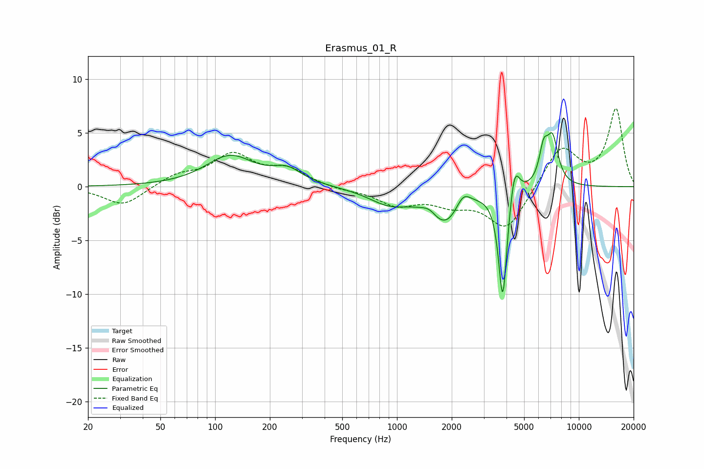

# Erasmus_01_R
See [usage instructions](https://github.com/jaakkopasanen/AutoEq#usage) for more options and info.

### Parametric EQs
Apply preamp of -5.1 dB when using parametric equalizer.

|   # | Type    |   Fc (Hz) |    Q |   Gain (dB) |
|-----|---------|-----------|------|-------------|
|   1 | Peaking |       121 | 1.07 |         2.8 |
|   2 | Peaking |       250 | 1.74 |         1.3 |
|   3 | Peaking |       910 | 1.22 |        -1.5 |
|   4 | Peaking |      1508 | 3.62 |         0.6 |
|   5 | Peaking |      1853 | 1.54 |        -3.3 |
|   6 | Peaking |      2309 | 3.45 |         1.5 |
|   7 | Peaking |      3816 | 5.99 |       -10.5 |
|   8 | Peaking |      4431 | 5.37 |         3.2 |
|   9 | Peaking |      6401 | 5.67 |         2.9 |
|  10 | Peaking |      7167 | 4.34 |         4.2 |

### Fixed Band EQs
When using fixed band (also called graphic) equalizer, apply preamp of **-7.4 dB** (if available) and set gains manually with these parameters.

|   # | Type    |   Fc (Hz) |    Q |   Gain (dB) |
|-----|---------|-----------|------|-------------|
|   1 | Peaking |        31 | 1.41 |        -1.8 |
|   2 | Peaking |        62 | 1.41 |         1   |
|   3 | Peaking |       125 | 1.41 |         2.8 |
|   4 | Peaking |       250 | 1.41 |         1.5 |
|   5 | Peaking |       500 | 1.41 |        -0.3 |
|   6 | Peaking |      1000 | 1.41 |        -1.6 |
|   7 | Peaking |      2000 | 1.41 |        -1.3 |
|   8 | Peaking |      4000 | 1.41 |        -4   |
|   9 | Peaking |      8000 | 1.41 |         3.8 |
|  10 | Peaking |     16000 | 1.41 |         7.2 |

### Graphs

