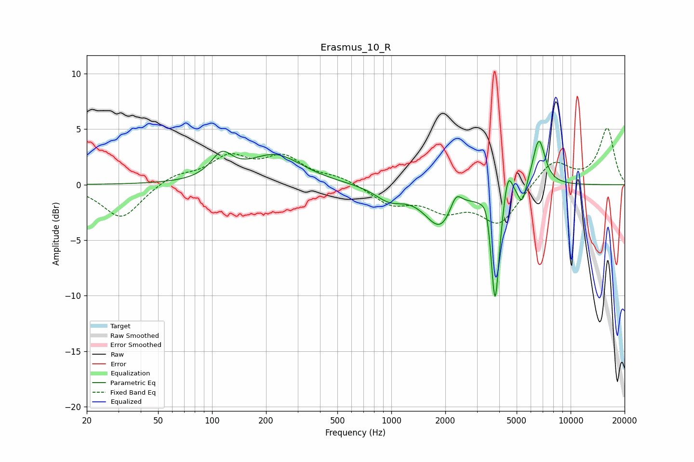

# Erasmus_10_R
See [usage instructions](https://github.com/jaakkopasanen/AutoEq#usage) for more options and info.

### Parametric EQs
Apply preamp of -4.0 dB when using parametric equalizer.

|   # | Type    |   Fc (Hz) |    Q |   Gain (dB) |
|-----|---------|-----------|------|-------------|
|   1 | Peaking |       113 | 2.4  |         2.1 |
|   2 | Peaking |       226 | 0.95 |         2.6 |
|   3 | Peaking |       975 | 1.76 |        -1.2 |
|   4 | Peaking |      1887 | 1.63 |        -3.8 |
|   5 | Peaking |      2288 | 4.19 |         1.7 |
|   6 | Peaking |      3405 | 6    |         1.4 |
|   7 | Peaking |      3790 | 5.95 |       -10.8 |
|   8 | Peaking |      4468 | 5.98 |         2.6 |
|   9 | Peaking |      5362 | 5.95 |        -1.9 |
|  10 | Peaking |      6646 | 3.91 |         4.3 |

### Fixed Band EQs
When using fixed band (also called graphic) equalizer, apply preamp of **-5.2 dB** (if available) and set gains manually with these parameters.

|   # | Type    |   Fc (Hz) |    Q |   Gain (dB) |
|-----|---------|-----------|------|-------------|
|   1 | Peaking |        31 | 1.41 |        -3.1 |
|   2 | Peaking |        62 | 1.41 |         0.9 |
|   3 | Peaking |       125 | 1.41 |         2.3 |
|   4 | Peaking |       250 | 1.41 |         2.3 |
|   5 | Peaking |       500 | 1.41 |         0.6 |
|   6 | Peaking |      1000 | 1.41 |        -1.6 |
|   7 | Peaking |      2000 | 1.41 |        -1.9 |
|   8 | Peaking |      4000 | 1.41 |        -3.4 |
|   9 | Peaking |      8000 | 1.41 |         2.3 |
|  10 | Peaking |     16000 | 1.41 |         5   |

### Graphs

