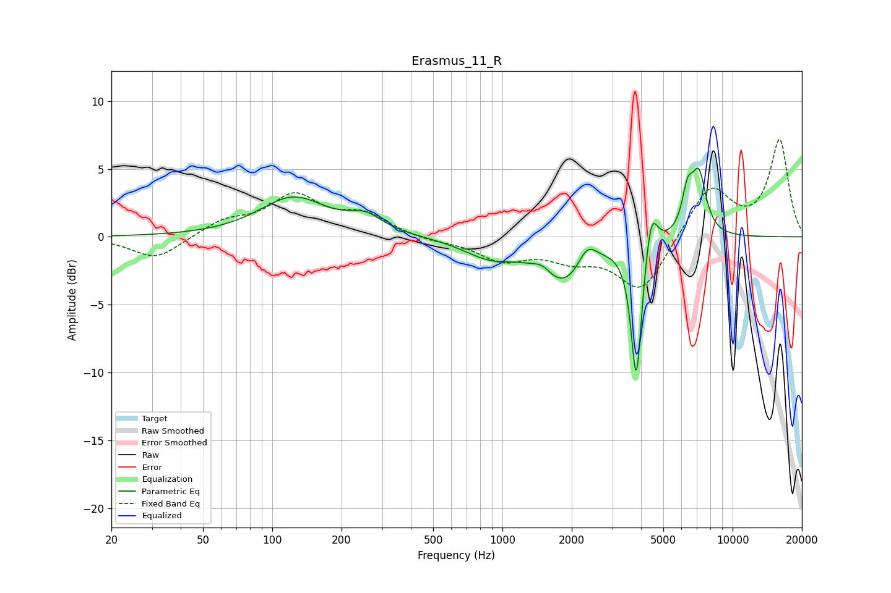

# Erasmus_11_R
See [usage instructions](https://github.com/jaakkopasanen/AutoEq#usage) for more options and info.

### Parametric EQs
Apply preamp of -5.2 dB when using parametric equalizer.

|   # | Type    |   Fc (Hz) |    Q |   Gain (dB) |
|-----|---------|-----------|------|-------------|
|   1 | Peaking |       123 | 0.97 |         2.8 |
|   2 | Peaking |       255 | 1.89 |         1.1 |
|   3 | Peaking |       883 | 1.22 |        -1.3 |
|   4 | Peaking |      1493 | 3.56 |         0.6 |
|   5 | Peaking |      1840 | 1.38 |        -3.3 |
|   6 | Peaking |      2335 | 3.47 |         1.6 |
|   7 | Peaking |      3818 | 6    |       -10.5 |
|   8 | Peaking |      4432 | 5.33 |         3.2 |
|   9 | Peaking |      6375 | 5.69 |         2.7 |
|  10 | Peaking |      7136 | 4.33 |         4.4 |

### Fixed Band EQs
When using fixed band (also called graphic) equalizer, apply preamp of **-7.3 dB** (if available) and set gains manually with these parameters.

|   # | Type    |   Fc (Hz) |    Q |   Gain (dB) |
|-----|---------|-----------|------|-------------|
|   1 | Peaking |        31 | 1.41 |        -1.7 |
|   2 | Peaking |        62 | 1.41 |         1.1 |
|   3 | Peaking |       125 | 1.41 |         2.9 |
|   4 | Peaking |       250 | 1.41 |         1.5 |
|   5 | Peaking |       500 | 1.41 |        -0.3 |
|   6 | Peaking |      1000 | 1.41 |        -1.6 |
|   7 | Peaking |      2000 | 1.41 |        -1.3 |
|   8 | Peaking |      4000 | 1.41 |        -4   |
|   9 | Peaking |      8000 | 1.41 |         3.8 |
|  10 | Peaking |     16000 | 1.41 |         7.1 |

### Graphs

