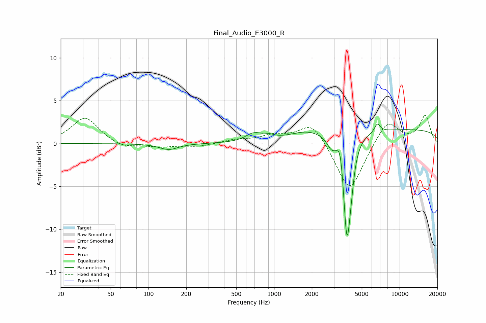

# Final_Audio_E3000_R
See [usage instructions](https://github.com/jaakkopasanen/AutoEq#usage) for more options and info.

### Parametric EQs
Apply preamp of -2.4 dB when using parametric equalizer.

|   # | Type    |   Fc (Hz) |    Q |   Gain (dB) |
|-----|---------|-----------|------|-------------|
|   1 | Peaking |       145 | 1.91 |        -0.7 |
|   2 | Peaking |       684 | 2.3  |         0.9 |
|   3 | Peaking |       897 | 2.89 |         0.4 |
|   4 | Peaking |      1806 | 1.08 |         0.9 |
|   5 | Peaking |      2860 | 4.08 |        -1.1 |
|   6 | Peaking |      3385 | 6    |         2.4 |
|   7 | Peaking |      3803 | 4.84 |       -11.9 |
|   8 | Peaking |      4100 | 5.9  |        -1.9 |
|   9 | Peaking |      6653 | 6    |         1   |
|  10 | Peaking |     10000 | 0.18 |         1.7 |

### Fixed Band EQs
When using fixed band (also called graphic) equalizer, apply preamp of **-3.4 dB** (if available) and set gains manually with these parameters.

|   # | Type    |   Fc (Hz) |    Q |   Gain (dB) |
|-----|---------|-----------|------|-------------|
|   1 | Peaking |        31 | 1.41 |         3.1 |
|   2 | Peaking |        62 | 1.41 |        -0.6 |
|   3 | Peaking |       125 | 1.41 |        -0.4 |
|   4 | Peaking |       250 | 1.41 |        -0.3 |
|   5 | Peaking |       500 | 1.41 |         0.4 |
|   6 | Peaking |      1000 | 1.41 |         0.8 |
|   7 | Peaking |      2000 | 1.41 |         2.6 |
|   8 | Peaking |      4000 | 1.41 |        -5.8 |
|   9 | Peaking |      8000 | 1.41 |         2.8 |
|  10 | Peaking |     16000 | 1.41 |         3.2 |

### Graphs

