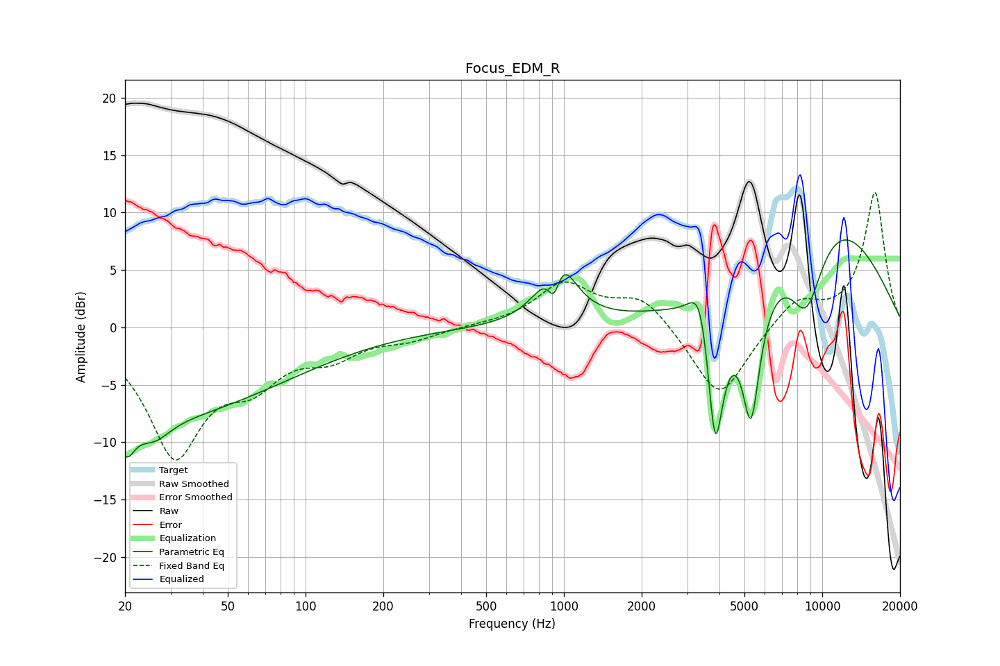

# Focus_EDM_R
See [usage instructions](https://github.com/jaakkopasanen/AutoEq#usage) for more options and info.

### Parametric EQs
Apply preamp of -7.7 dB when using parametric equalizer.

|   # | Type    |   Fc (Hz) |    Q |   Gain (dB) |
|-----|---------|-----------|------|-------------|
|   1 | Peaking |        20 | 4.64 |        -2.6 |
|   2 | Peaking |        21 | 0.23 |        -8   |
|   3 | Peaking |        26 | 2.37 |        -1.6 |
|   4 | Peaking |       916 | 5.43 |        -4.1 |
|   5 | Peaking |       940 | 2.38 |         7.1 |
|   6 | Peaking |      3383 | 3.43 |         5   |
|   7 | Peaking |      3850 | 3.98 |       -14.2 |
|   8 | Peaking |      5301 | 3.74 |       -11.6 |
|   9 | Peaking |      8680 | 1.84 |        -7.3 |
|  10 | Peaking |     10000 | 0.43 |        10.3 |

### Fixed Band EQs
When using fixed band (also called graphic) equalizer, apply preamp of **-11.8 dB** (if available) and set gains manually with these parameters.

|   # | Type    |   Fc (Hz) |    Q |   Gain (dB) |
|-----|---------|-----------|------|-------------|
|   1 | Peaking |        31 | 1.41 |       -10.8 |
|   2 | Peaking |        62 | 1.41 |        -3.6 |
|   3 | Peaking |       125 | 1.41 |        -2.1 |
|   4 | Peaking |       250 | 1.41 |        -0.9 |
|   5 | Peaking |       500 | 1.41 |         0.1 |
|   6 | Peaking |      1000 | 1.41 |         3.7 |
|   7 | Peaking |      2000 | 1.41 |         2.7 |
|   8 | Peaking |      4000 | 1.41 |        -6.5 |
|   9 | Peaking |      8000 | 1.41 |         2.5 |
|  10 | Peaking |     16000 | 1.41 |        11.8 |

### Graphs

