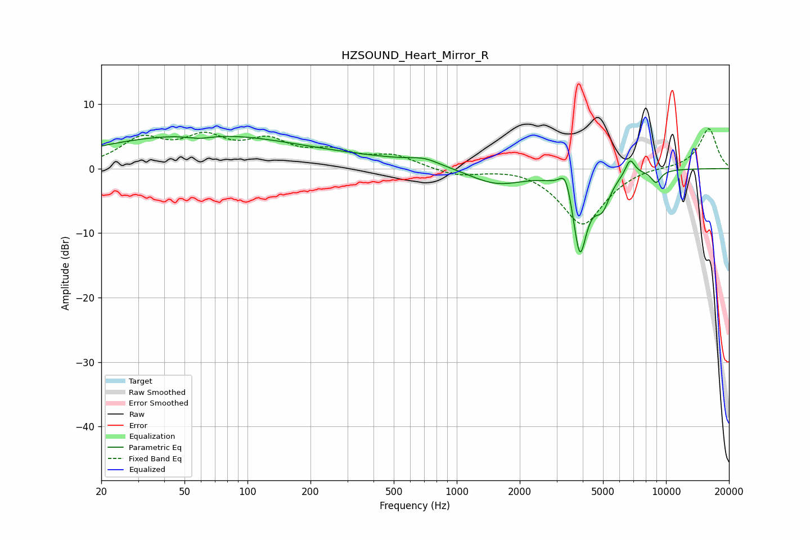

# HZSOUND_Heart_Mirror_R
See [usage instructions](https://github.com/jaakkopasanen/AutoEq#usage) for more options and info.

### Parametric EQs
Apply preamp of -5.1 dB when using parametric equalizer.

|   # | Type    |   Fc (Hz) |    Q |   Gain (dB) |
|-----|---------|-----------|------|-------------|
|   1 | Peaking |        49 | 0.31 |         4.7 |
|   2 | Peaking |        59 | 2.3  |        -0.6 |
|   3 | Peaking |       261 | 0.29 |         1.5 |
|   4 | Peaking |       701 | 2.04 |         0.8 |
|   5 | Peaking |      1544 | 1.05 |        -2.6 |
|   6 | Peaking |      3320 | 4.86 |         3.9 |
|   7 | Peaking |      3875 | 3.88 |       -13   |
|   8 | Peaking |      4962 | 3.79 |        -4.1 |
|   9 | Peaking |      6738 | 6    |         2.5 |
|  10 | Peaking |      8965 | 5.4  |        -1.9 |

### Fixed Band EQs
When using fixed band (also called graphic) equalizer, apply preamp of **-6.2 dB** (if available) and set gains manually with these parameters.

|   # | Type    |   Fc (Hz) |    Q |   Gain (dB) |
|-----|---------|-----------|------|-------------|
|   1 | Peaking |        31 | 1.41 |         4.2 |
|   2 | Peaking |        62 | 1.41 |         4.1 |
|   3 | Peaking |       125 | 1.41 |         3.7 |
|   4 | Peaking |       250 | 1.41 |         2.2 |
|   5 | Peaking |       500 | 1.41 |         1.9 |
|   6 | Peaking |      1000 | 1.41 |        -1.1 |
|   7 | Peaking |      2000 | 1.41 |         0.4 |
|   8 | Peaking |      4000 | 1.41 |        -8.8 |
|   9 | Peaking |      8000 | 1.41 |         0.4 |
|  10 | Peaking |     16000 | 1.41 |         6.3 |

### Graphs

