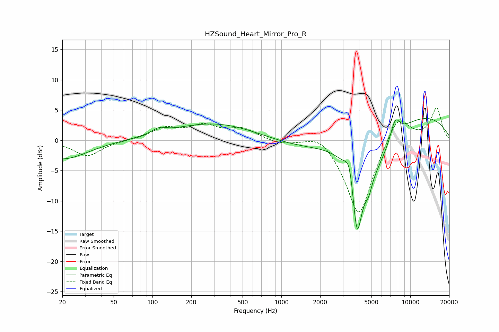

# HZSound_Heart_Mirror_Pro_R
See [usage instructions](https://github.com/jaakkopasanen/AutoEq#usage) for more options and info.

### Parametric EQs
Apply preamp of -3.7 dB when using parametric equalizer.

|   # | Type    |   Fc (Hz) |    Q |   Gain (dB) |
|-----|---------|-----------|------|-------------|
|   1 | Peaking |        20 | 0.73 |        -3.1 |
|   2 | Peaking |       112 | 2.64 |         0.9 |
|   3 | Peaking |       306 | 0.43 |         2.9 |
|   4 | Peaking |      1673 | 0.48 |        -1.8 |
|   5 | Peaking |      3397 | 3.9  |         4.9 |
|   6 | Peaking |      3854 | 3.08 |       -14.5 |
|   7 | Peaking |      4764 | 5.52 |        -1.8 |
|   8 | Peaking |      5181 | 0.86 |        -6.8 |
|   9 | Peaking |      7628 | 3.55 |         3.3 |
|  10 | Peaking |      8792 | 0.25 |         5.1 |

### Fixed Band EQs
When using fixed band (also called graphic) equalizer, apply preamp of **-5.4 dB** (if available) and set gains manually with these parameters.

|   # | Type    |   Fc (Hz) |    Q |   Gain (dB) |
|-----|---------|-----------|------|-------------|
|   1 | Peaking |        31 | 1.41 |        -2.6 |
|   2 | Peaking |        62 | 1.41 |         0   |
|   3 | Peaking |       125 | 1.41 |         1.9 |
|   4 | Peaking |       250 | 1.41 |         2.2 |
|   5 | Peaking |       500 | 1.41 |         1.8 |
|   6 | Peaking |      1000 | 1.41 |        -0.6 |
|   7 | Peaking |      2000 | 1.41 |         1.9 |
|   8 | Peaking |      4000 | 1.41 |       -12.9 |
|   9 | Peaking |      8000 | 1.41 |         4.9 |
|  10 | Peaking |     16000 | 1.41 |         5.3 |

### Graphs

