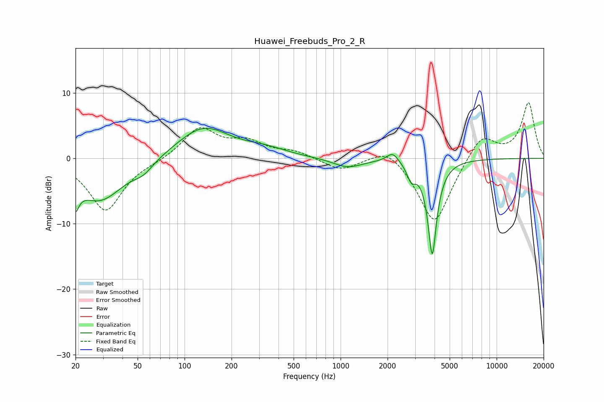

# Huawei_Freebuds_Pro_2_R
See [usage instructions](https://github.com/jaakkopasanen/AutoEq#usage) for more options and info.

### Parametric EQs
Apply preamp of -4.7 dB when using parametric equalizer.

|   # | Type    |   Fc (Hz) |    Q |   Gain (dB) |
|-----|---------|-----------|------|-------------|
|   1 | Peaking |        20 | 5.76 |        -7.1 |
|   2 | Peaking |        20 | 5.91 |         3.2 |
|   3 | Peaking |        29 | 0.9  |        -6.5 |
|   4 | Peaking |        55 | 2.32 |        -1.3 |
|   5 | Peaking |       132 | 0.83 |         4.9 |
|   6 | Peaking |       329 | 1.03 |         1   |
|   7 | Peaking |      1109 | 1.5  |        -1.4 |
|   8 | Peaking |      2157 | 3.7  |         1.5 |
|   9 | Peaking |      2841 | 5.15 |        -2.2 |
|  10 | Peaking |      3867 | 4.87 |       -14.5 |

### Fixed Band EQs
When using fixed band (also called graphic) equalizer, apply preamp of **-8.6 dB** (if available) and set gains manually with these parameters.

|   # | Type    |   Fc (Hz) |    Q |   Gain (dB) |
|-----|---------|-----------|------|-------------|
|   1 | Peaking |        31 | 1.41 |        -8   |
|   2 | Peaking |        62 | 1.41 |        -0.3 |
|   3 | Peaking |       125 | 1.41 |         4.6 |
|   4 | Peaking |       250 | 1.41 |         2.2 |
|   5 | Peaking |       500 | 1.41 |         1   |
|   6 | Peaking |      1000 | 1.41 |        -1.8 |
|   7 | Peaking |      2000 | 1.41 |         2.3 |
|   8 | Peaking |      4000 | 1.41 |       -10.3 |
|   9 | Peaking |      8000 | 1.41 |         4   |
|  10 | Peaking |     16000 | 1.41 |         8.5 |

### Graphs

