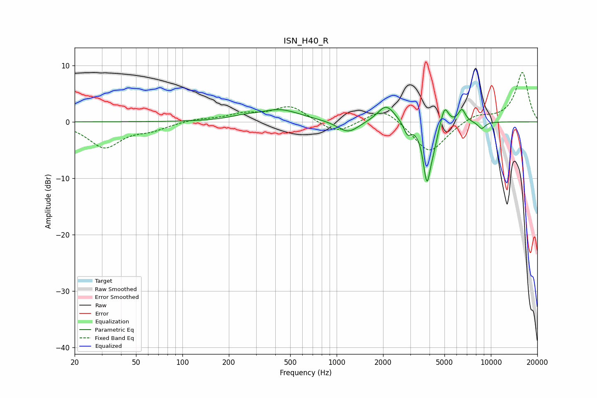

# ISN_H40_R
See [usage instructions](https://github.com/jaakkopasanen/AutoEq#usage) for more options and info.

### Parametric EQs
Apply preamp of -2.7 dB when using parametric equalizer.

|   # | Type    |   Fc (Hz) |    Q |   Gain (dB) |
|-----|---------|-----------|------|-------------|
|   1 | Peaking |       246 | 1.52 |         0.5 |
|   2 | Peaking |       431 | 1.06 |         2.1 |
|   3 | Peaking |      1189 | 2.07 |        -2.1 |
|   4 | Peaking |      2096 | 2.52 |         3.1 |
|   5 | Peaking |      2883 | 5.9  |        -2.1 |
|   6 | Peaking |      3851 | 5.5  |       -10.2 |
|   7 | Peaking |      4256 | 6    |        -2.1 |
|   8 | Peaking |      5015 | 5.75 |         3.3 |
|   9 | Peaking |      6485 | 5.94 |         2.3 |
|  10 | Peaking |      8705 | 5.35 |        -1.3 |

### Fixed Band EQs
When using fixed band (also called graphic) equalizer, apply preamp of **-8.8 dB** (if available) and set gains manually with these parameters.

|   # | Type    |   Fc (Hz) |    Q |   Gain (dB) |
|-----|---------|-----------|------|-------------|
|   1 | Peaking |        31 | 1.41 |        -4.5 |
|   2 | Peaking |        62 | 1.41 |        -1.2 |
|   3 | Peaking |       125 | 1.41 |         0.5 |
|   4 | Peaking |       250 | 1.41 |         1.2 |
|   5 | Peaking |       500 | 1.41 |         2.8 |
|   6 | Peaking |      1000 | 1.41 |        -2.2 |
|   7 | Peaking |      2000 | 1.41 |         2.8 |
|   8 | Peaking |      4000 | 1.41 |        -5.7 |
|   9 | Peaking |      8000 | 1.41 |         1.3 |
|  10 | Peaking |     16000 | 1.41 |         8.8 |

### Graphs

