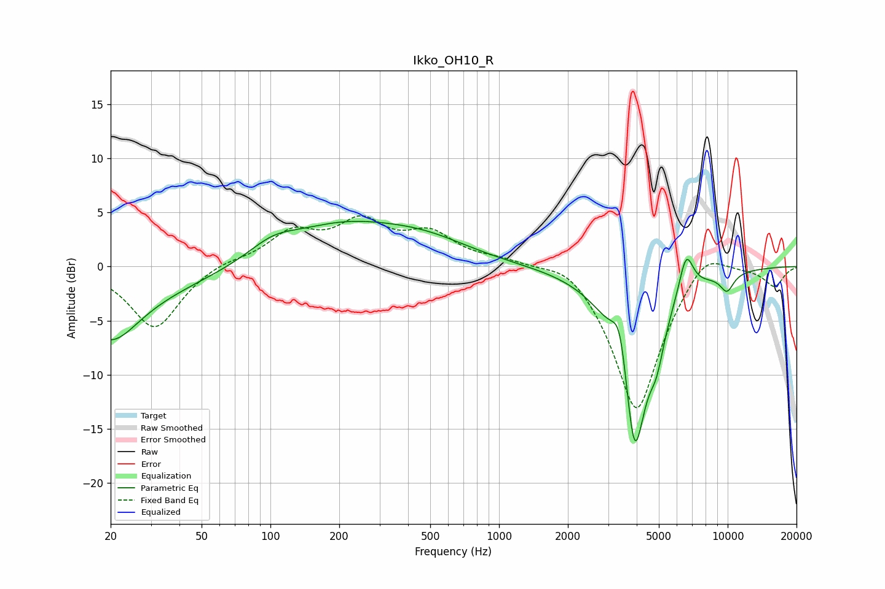

# Ikko_OH10_R
See [usage instructions](https://github.com/jaakkopasanen/AutoEq#usage) for more options and info.

### Parametric EQs
Apply preamp of -4.3 dB when using parametric equalizer.

|   # | Type    |   Fc (Hz) |    Q |   Gain (dB) |
|-----|---------|-----------|------|-------------|
|   1 | Peaking |        20 | 1.19 |        -4.6 |
|   2 | Peaking |        21 | 0.36 |        -2.3 |
|   3 | Peaking |       102 | 1.36 |         1.3 |
|   4 | Peaking |       205 | 0.53 |         3.5 |
|   5 | Peaking |       484 | 0.69 |         1.7 |
|   6 | Peaking |      3382 | 3.99 |         4.8 |
|   7 | Peaking |      3912 | 2.24 |       -17.7 |
|   8 | Peaking |      4894 | 4.44 |        -2.8 |
|   9 | Peaking |      6580 | 4.22 |         3.8 |
|  10 | Peaking |      9930 | 4    |        -1.6 |

### Fixed Band EQs
When using fixed band (also called graphic) equalizer, apply preamp of **-4.8 dB** (if available) and set gains manually with these parameters.

|   # | Type    |   Fc (Hz) |    Q |   Gain (dB) |
|-----|---------|-----------|------|-------------|
|   1 | Peaking |        31 | 1.41 |        -5.8 |
|   2 | Peaking |        62 | 1.41 |         0.6 |
|   3 | Peaking |       125 | 1.41 |         2.9 |
|   4 | Peaking |       250 | 1.41 |         3.7 |
|   5 | Peaking |       500 | 1.41 |         2.7 |
|   6 | Peaking |      1000 | 1.41 |         0.6 |
|   7 | Peaking |      2000 | 1.41 |         1.4 |
|   8 | Peaking |      4000 | 1.41 |       -13.7 |
|   9 | Peaking |      8000 | 1.41 |         2.5 |
|  10 | Peaking |     16000 | 1.41 |        -1.8 |

### Graphs

