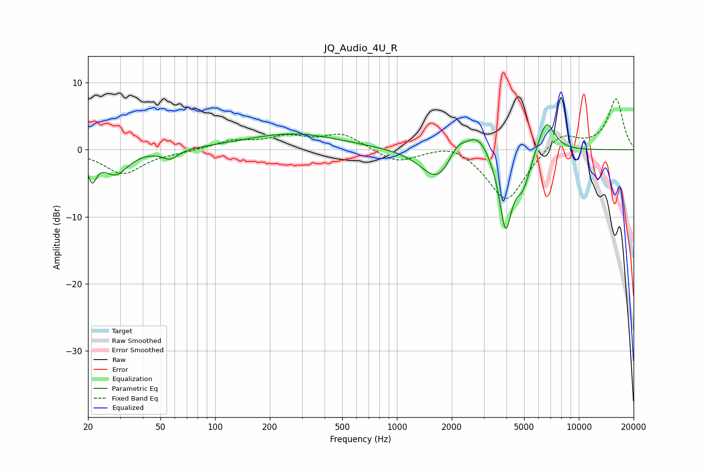

# JQ_Audio_4U_R
See [usage instructions](https://github.com/jaakkopasanen/AutoEq#usage) for more options and info.

### Parametric EQs
Apply preamp of -3.8 dB when using parametric equalizer.

|   # | Type    |   Fc (Hz) |    Q |   Gain (dB) |
|-----|---------|-----------|------|-------------|
|   1 | Peaking |        21 | 5.85 |        -3.6 |
|   2 | Peaking |        28 | 2.09 |        -3.5 |
|   3 | Peaking |        57 | 3.29 |        -1.4 |
|   4 | Peaking |       269 | 0.53 |         2.4 |
|   5 | Peaking |      1670 | 1.59 |        -4.8 |
|   6 | Peaking |      2139 | 3.02 |         2.1 |
|   7 | Peaking |      2781 | 2.01 |         3.6 |
|   8 | Peaking |      3954 | 3.8  |       -11.7 |
|   9 | Peaking |      4945 | 3.33 |        -4.3 |
|  10 | Peaking |      6617 | 2.97 |         5   |

### Fixed Band EQs
When using fixed band (also called graphic) equalizer, apply preamp of **-7.7 dB** (if available) and set gains manually with these parameters.

|   # | Type    |   Fc (Hz) |    Q |   Gain (dB) |
|-----|---------|-----------|------|-------------|
|   1 | Peaking |        31 | 1.41 |        -3.6 |
|   2 | Peaking |        62 | 1.41 |        -0.3 |
|   3 | Peaking |       125 | 1.41 |         1.3 |
|   4 | Peaking |       250 | 1.41 |         1.7 |
|   5 | Peaking |       500 | 1.41 |         2.3 |
|   6 | Peaking |      1000 | 1.41 |        -2   |
|   7 | Peaking |      2000 | 1.41 |         1.3 |
|   8 | Peaking |      4000 | 1.41 |        -7.9 |
|   9 | Peaking |      8000 | 1.41 |         2.7 |
|  10 | Peaking |     16000 | 1.41 |         7.6 |

### Graphs

