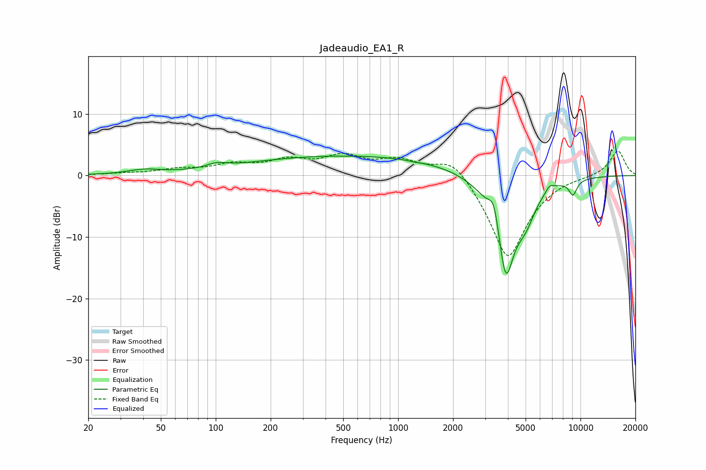

# Jadeaudio_EA1_R
See [usage instructions](https://github.com/jaakkopasanen/AutoEq#usage) for more options and info.

### Parametric EQs
Apply preamp of -3.3 dB when using parametric equalizer.

|   # | Type    |   Fc (Hz) |    Q |   Gain (dB) |
|-----|---------|-----------|------|-------------|
|   1 | Peaking |        40 | 1.56 |         0.7 |
|   2 | Peaking |       101 | 2.65 |         0.7 |
|   3 | Peaking |       562 | 0.23 |         3.2 |
|   4 | Peaking |      1231 | 6    |        -0.1 |
|   5 | Peaking |      3351 | 5.36 |         3.6 |
|   6 | Peaking |      3378 | 3.18 |         0.7 |
|   7 | Peaking |      3894 | 2.48 |       -16.9 |
|   8 | Peaking |      5012 | 2.64 |        -3.7 |
|   9 | Peaking |      6790 | 6    |         1   |
|  10 | Peaking |      9091 | 5.86 |        -2.4 |

### Fixed Band EQs
When using fixed band (also called graphic) equalizer, apply preamp of **-4.1 dB** (if available) and set gains manually with these parameters.

|   # | Type    |   Fc (Hz) |    Q |   Gain (dB) |
|-----|---------|-----------|------|-------------|
|   1 | Peaking |        31 | 1.41 |         0.3 |
|   2 | Peaking |        62 | 1.41 |         0.9 |
|   3 | Peaking |       125 | 1.41 |         1.5 |
|   4 | Peaking |       250 | 1.41 |         2.1 |
|   5 | Peaking |       500 | 1.41 |         2.8 |
|   6 | Peaking |      1000 | 1.41 |         2.3 |
|   7 | Peaking |      2000 | 1.41 |         3.6 |
|   8 | Peaking |      4000 | 1.41 |       -13.8 |
|   9 | Peaking |      8000 | 1.41 |         0.2 |
|  10 | Peaking |     16000 | 1.41 |         4.1 |

### Graphs

