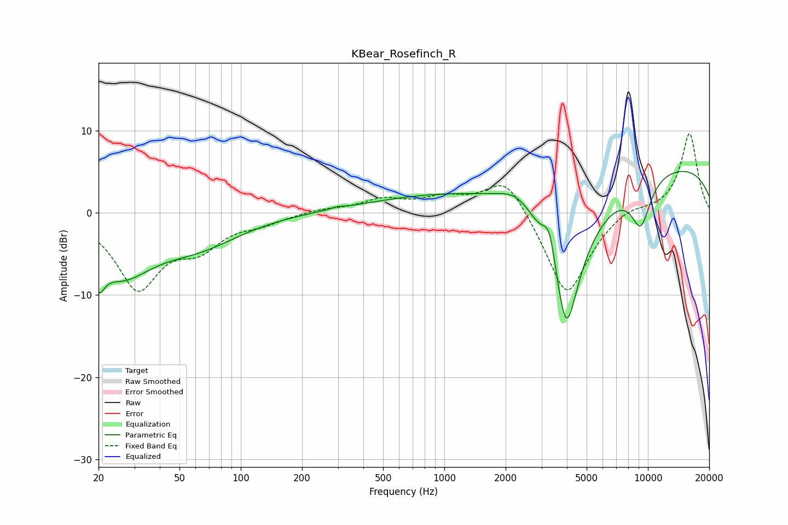

# KBear_Rosefinch_R
See [usage instructions](https://github.com/jaakkopasanen/AutoEq#usage) for more options and info.

### Parametric EQs
Apply preamp of -5.1 dB when using parametric equalizer.

|   # | Type    |   Fc (Hz) |    Q |   Gain (dB) |
|-----|---------|-----------|------|-------------|
|   1 | Peaking |        20 | 5.02 |        -3.4 |
|   2 | Peaking |        26 | 0.89 |        -6.7 |
|   3 | Peaking |        62 | 0.68 |        -3.3 |
|   4 | Peaking |       297 | 5.14 |         0.2 |
|   5 | Peaking |      1021 | 0.36 |         2.1 |
|   6 | Peaking |      2298 | 1.55 |         2.5 |
|   7 | Peaking |      3284 | 4.34 |         4.4 |
|   8 | Peaking |      3964 | 1.55 |       -20   |
|   9 | Peaking |      9226 | 2.59 |        -5.5 |
|  10 | Peaking |     10000 | 0.19 |         6.3 |

### Fixed Band EQs
When using fixed band (also called graphic) equalizer, apply preamp of **-9.7 dB** (if available) and set gains manually with these parameters.

|   # | Type    |   Fc (Hz) |    Q |   Gain (dB) |
|-----|---------|-----------|------|-------------|
|   1 | Peaking |        31 | 1.41 |        -8.9 |
|   2 | Peaking |        62 | 1.41 |        -3.4 |
|   3 | Peaking |       125 | 1.41 |        -1   |
|   4 | Peaking |       250 | 1.41 |         0.5 |
|   5 | Peaking |       500 | 1.41 |         1.5 |
|   6 | Peaking |      1000 | 1.41 |         1.6 |
|   7 | Peaking |      2000 | 1.41 |         4.8 |
|   8 | Peaking |      4000 | 1.41 |       -10.5 |
|   9 | Peaking |      8000 | 1.41 |         1   |
|  10 | Peaking |     16000 | 1.41 |         9.7 |

### Graphs

