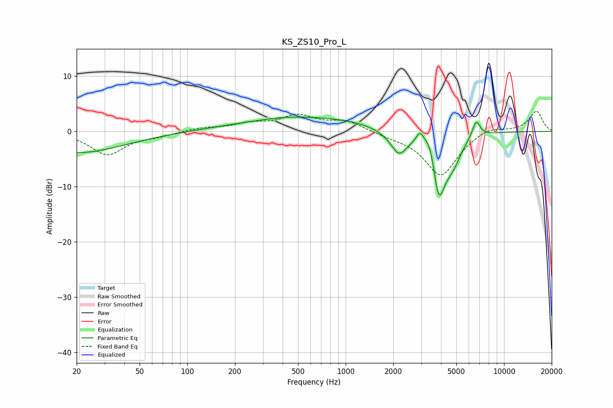

# KS_ZS10_Pro_L
See [usage instructions](https://github.com/jaakkopasanen/AutoEq#usage) for more options and info.

### Parametric EQs
Apply preamp of -2.7 dB when using parametric equalizer.

|   # | Type    |   Fc (Hz) |    Q |   Gain (dB) |
|-----|---------|-----------|------|-------------|
|   1 | Peaking |        20 | 0.47 |        -3.9 |
|   2 | Peaking |       422 | 1.34 |         0.2 |
|   3 | Peaking |       625 | 0.3  |         2.6 |
|   4 | Peaking |      2018 | 1.2  |        -1   |
|   5 | Peaking |      2174 | 2.9  |        -3.6 |
|   6 | Peaking |      2945 | 5.97 |         2.1 |
|   7 | Peaking |      3430 | 3.76 |         4.3 |
|   8 | Peaking |      3864 | 3.05 |       -12.5 |
|   9 | Peaking |      4779 | 2.72 |        -3.5 |
|  10 | Peaking |      6670 | 5.45 |         3.1 |

### Fixed Band EQs
When using fixed band (also called graphic) equalizer, apply preamp of **-3.8 dB** (if available) and set gains manually with these parameters.

|   # | Type    |   Fc (Hz) |    Q |   Gain (dB) |
|-----|---------|-----------|------|-------------|
|   1 | Peaking |        31 | 1.41 |        -4.2 |
|   2 | Peaking |        62 | 1.41 |        -0.7 |
|   3 | Peaking |       125 | 1.41 |         0.6 |
|   4 | Peaking |       250 | 1.41 |         1.2 |
|   5 | Peaking |       500 | 1.41 |         2.6 |
|   6 | Peaking |      1000 | 1.41 |         1.8 |
|   7 | Peaking |      2000 | 1.41 |        -0.6 |
|   8 | Peaking |      4000 | 1.41 |        -8   |
|   9 | Peaking |      8000 | 1.41 |         1.1 |
|  10 | Peaking |     16000 | 1.41 |         3.7 |

### Graphs

