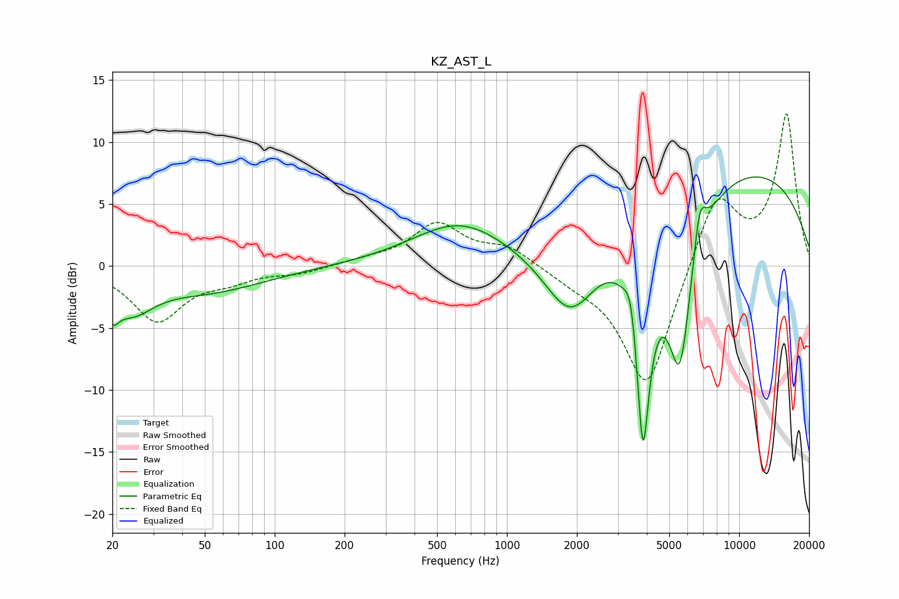

# KZ_AST_L
See [usage instructions](https://github.com/jaakkopasanen/AutoEq#usage) for more options and info.

### Parametric EQs
Apply preamp of -7.3 dB when using parametric equalizer.

|   # | Type    |   Fc (Hz) |    Q |   Gain (dB) |
|-----|---------|-----------|------|-------------|
|   1 | Peaking |        20 | 5.84 |        -1.7 |
|   2 | Peaking |        24 | 1.46 |        -2.9 |
|   3 | Peaking |        52 | 0.57 |        -1.9 |
|   4 | Peaking |       627 | 0.69 |         3.4 |
|   5 | Peaking |      1876 | 1.23 |        -5.9 |
|   6 | Peaking |      3420 | 5.65 |         2.7 |
|   7 | Peaking |      3852 | 4.31 |       -16.5 |
|   8 | Peaking |      5555 | 2.33 |       -13.5 |
|   9 | Peaking |      6749 | 4.97 |         3.8 |
|  10 | Peaking |      9370 | 0.25 |         8.2 |

### Fixed Band EQs
When using fixed band (also called graphic) equalizer, apply preamp of **-12.3 dB** (if available) and set gains manually with these parameters.

|   # | Type    |   Fc (Hz) |    Q |   Gain (dB) |
|-----|---------|-----------|------|-------------|
|   1 | Peaking |        31 | 1.41 |        -4.3 |
|   2 | Peaking |        62 | 1.41 |        -0.9 |
|   3 | Peaking |       125 | 1.41 |        -0.5 |
|   4 | Peaking |       250 | 1.41 |         0.4 |
|   5 | Peaking |       500 | 1.41 |         3.3 |
|   6 | Peaking |      1000 | 1.41 |         1.5 |
|   7 | Peaking |      2000 | 1.41 |        -0.8 |
|   8 | Peaking |      4000 | 1.41 |       -10.2 |
|   9 | Peaking |      8000 | 1.41 |         6.2 |
|  10 | Peaking |     16000 | 1.41 |        12.1 |

### Graphs

