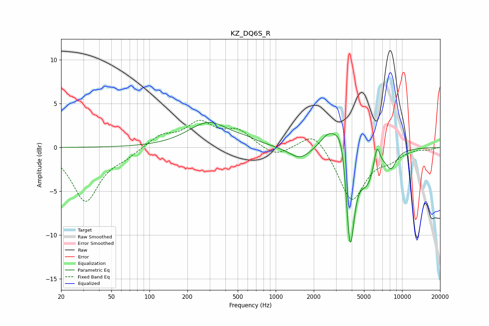

# KZ_DQ6S_R
See [usage instructions](https://github.com/jaakkopasanen/AutoEq#usage) for more options and info.

### Parametric EQs
Apply preamp of -3.0 dB when using parametric equalizer.

|   # | Type    |   Fc (Hz) |    Q |   Gain (dB) |
|-----|---------|-----------|------|-------------|
|   1 | Peaking |       295 | 0.88 |         2.8 |
|   2 | Peaking |       582 | 1.63 |         0.4 |
|   3 | Peaking |      1552 | 1.69 |        -1.4 |
|   4 | Peaking |      2618 | 2.19 |         1.7 |
|   5 | Peaking |      3372 | 2.57 |         4.1 |
|   6 | Peaking |      3778 | 6    |        -2.2 |
|   7 | Peaking |      3903 | 4.07 |       -10.6 |
|   8 | Peaking |      5286 | 2.08 |        -3.6 |
|   9 | Peaking |      6326 | 6    |         2.6 |
|  10 | Peaking |      8190 | 3.15 |        -1.9 |

### Fixed Band EQs
When using fixed band (also called graphic) equalizer, apply preamp of **-3.2 dB** (if available) and set gains manually with these parameters.

|   # | Type    |   Fc (Hz) |    Q |   Gain (dB) |
|-----|---------|-----------|------|-------------|
|   1 | Peaking |        31 | 1.41 |        -6.1 |
|   2 | Peaking |        62 | 1.41 |        -0.8 |
|   3 | Peaking |       125 | 1.41 |         1.3 |
|   4 | Peaking |       250 | 1.41 |         2.6 |
|   5 | Peaking |       500 | 1.41 |         1.8 |
|   6 | Peaking |      1000 | 1.41 |        -1.1 |
|   7 | Peaking |      2000 | 1.41 |         2.1 |
|   8 | Peaking |      4000 | 1.41 |        -6.1 |
|   9 | Peaking |      8000 | 1.41 |        -1.1 |
|  10 | Peaking |     16000 | 1.41 |        -0.2 |

### Graphs

