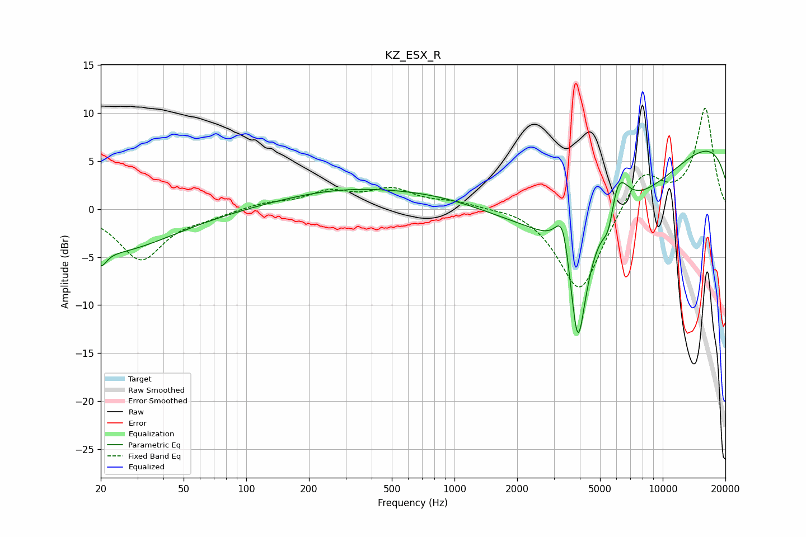

# KZ_ESX_R
See [usage instructions](https://github.com/jaakkopasanen/AutoEq#usage) for more options and info.

### Parametric EQs
Apply preamp of -6.1 dB when using parametric equalizer.

|   # | Type    |   Fc (Hz) |    Q |   Gain (dB) |
|-----|---------|-----------|------|-------------|
|   1 | Peaking |        20 | 5.29 |        -1.6 |
|   2 | Peaking |        22 | 0.48 |        -4.4 |
|   3 | Peaking |       489 | 0.52 |        -1.5 |
|   4 | Peaking |       496 | 0.35 |         3.9 |
|   5 | Peaking |      3315 | 3.91 |         5   |
|   6 | Peaking |      3908 | 3.38 |       -13.3 |
|   7 | Peaking |      4730 | 0.33 |       -10   |
|   8 | Peaking |      5511 | 4.63 |        -3.4 |
|   9 | Peaking |      6022 | 2.67 |         5.6 |
|  10 | Peaking |     10000 | 0.18 |         9.6 |

### Fixed Band EQs
When using fixed band (also called graphic) equalizer, apply preamp of **-10.6 dB** (if available) and set gains manually with these parameters.

|   # | Type    |   Fc (Hz) |    Q |   Gain (dB) |
|-----|---------|-----------|------|-------------|
|   1 | Peaking |        31 | 1.41 |        -5.2 |
|   2 | Peaking |        62 | 1.41 |        -0.6 |
|   3 | Peaking |       125 | 1.41 |         0.6 |
|   4 | Peaking |       250 | 1.41 |         1.6 |
|   5 | Peaking |       500 | 1.41 |         1.9 |
|   6 | Peaking |      1000 | 1.41 |         0.7 |
|   7 | Peaking |      2000 | 1.41 |         0.4 |
|   8 | Peaking |      4000 | 1.41 |        -9   |
|   9 | Peaking |      8000 | 1.41 |         4.2 |
|  10 | Peaking |     16000 | 1.41 |        10.5 |

### Graphs

