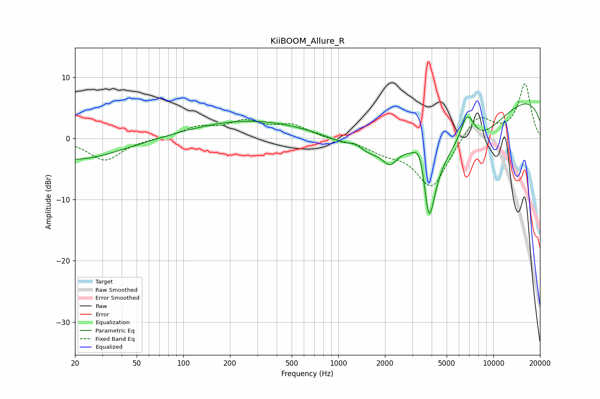

# KiiBOOM_Allure_R
See [usage instructions](https://github.com/jaakkopasanen/AutoEq#usage) for more options and info.

### Parametric EQs
Apply preamp of -5.7 dB when using parametric equalizer.

|   # | Type    |   Fc (Hz) |    Q |   Gain (dB) |
|-----|---------|-----------|------|-------------|
|   1 | Peaking |        20 | 0.49 |        -3.5 |
|   2 | Peaking |       266 | 0.37 |         3   |
|   3 | Peaking |      1287 | 3.76 |         0.9 |
|   4 | Peaking |      1592 | 0.8  |        -4   |
|   5 | Peaking |      2161 | 3.1  |        -2.5 |
|   6 | Peaking |      3397 | 3.38 |         5.5 |
|   7 | Peaking |      3839 | 2.83 |       -16.1 |
|   8 | Peaking |      6791 | 2.73 |         5.7 |
|   9 | Peaking |      7018 | 0.57 |        -8.9 |
|  10 | Peaking |     10000 | 0.18 |         8.6 |

### Fixed Band EQs
When using fixed band (also called graphic) equalizer, apply preamp of **-9.0 dB** (if available) and set gains manually with these parameters.

|   # | Type    |   Fc (Hz) |    Q |   Gain (dB) |
|-----|---------|-----------|------|-------------|
|   1 | Peaking |        31 | 1.41 |        -3.6 |
|   2 | Peaking |        62 | 1.41 |         0   |
|   3 | Peaking |       125 | 1.41 |         1.7 |
|   4 | Peaking |       250 | 1.41 |         2.5 |
|   5 | Peaking |       500 | 1.41 |         2   |
|   6 | Peaking |      1000 | 1.41 |        -0.2 |
|   7 | Peaking |      2000 | 1.41 |        -1.7 |
|   8 | Peaking |      4000 | 1.41 |        -8.1 |
|   9 | Peaking |      8000 | 1.41 |         4.1 |
|  10 | Peaking |     16000 | 1.41 |         8.9 |

### Graphs

