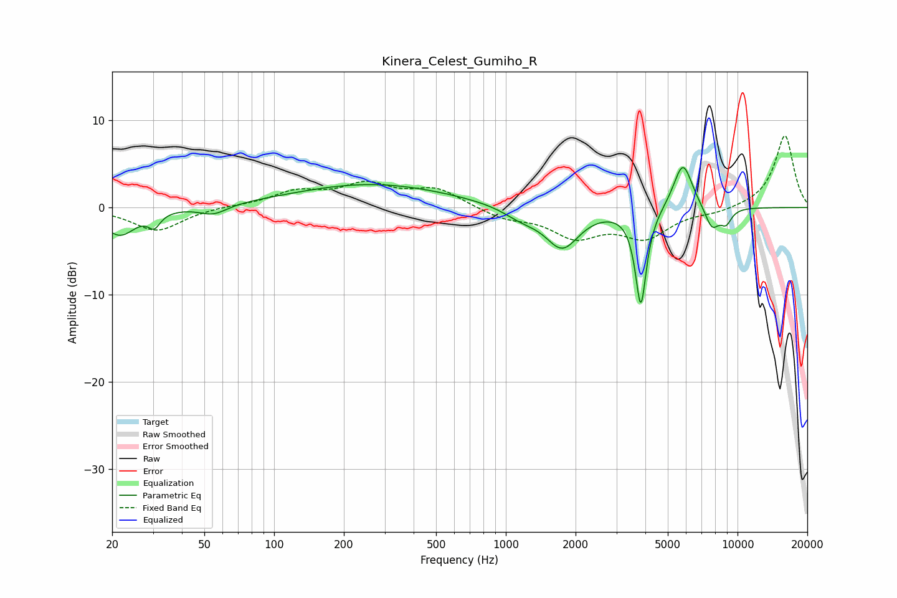

# Kinera_Celest_Gumiho_R
See [usage instructions](https://github.com/jaakkopasanen/AutoEq#usage) for more options and info.

### Parametric EQs
Apply preamp of -4.7 dB when using parametric equalizer.

|   # | Type    |   Fc (Hz) |    Q |   Gain (dB) |
|-----|---------|-----------|------|-------------|
|   1 | Peaking |        22 | 2.05 |        -3.2 |
|   2 | Peaking |        30 | 5.72 |        -1.5 |
|   3 | Peaking |        55 | 2.37 |        -1.1 |
|   4 | Peaking |       264 | 0.42 |         2.7 |
|   5 | Peaking |      1167 | 1.78 |        -1.2 |
|   6 | Peaking |      1752 | 1.93 |        -4.5 |
|   7 | Peaking |      3826 | 5.81 |       -11.2 |
|   8 | Peaking |      5811 | 3.32 |         5.5 |
|   9 | Peaking |      7758 | 4.18 |        -2.6 |
|  10 | Peaking |      8921 | 5.14 |        -1.6 |

### Fixed Band EQs
When using fixed band (also called graphic) equalizer, apply preamp of **-8.3 dB** (if available) and set gains manually with these parameters.

|   # | Type    |   Fc (Hz) |    Q |   Gain (dB) |
|-----|---------|-----------|------|-------------|
|   1 | Peaking |        31 | 1.41 |        -2.7 |
|   2 | Peaking |        62 | 1.41 |         0.2 |
|   3 | Peaking |       125 | 1.41 |         1.7 |
|   4 | Peaking |       250 | 1.41 |         2.4 |
|   5 | Peaking |       500 | 1.41 |         2   |
|   6 | Peaking |      1000 | 1.41 |        -1.1 |
|   7 | Peaking |      2000 | 1.41 |        -3.1 |
|   8 | Peaking |      4000 | 1.41 |        -3.2 |
|   9 | Peaking |      8000 | 1.41 |        -0.5 |
|  10 | Peaking |     16000 | 1.41 |         8.3 |

### Graphs

