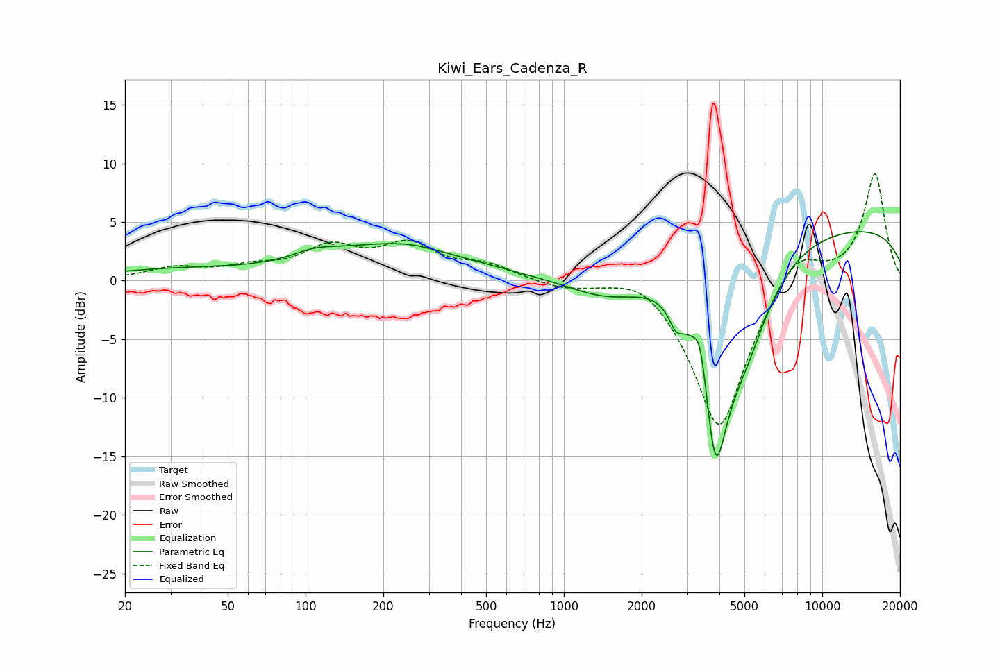

# Kiwi_Ears_Cadenza_R
See [usage instructions](https://github.com/jaakkopasanen/AutoEq#usage) for more options and info.

### Parametric EQs
Apply preamp of -4.3 dB when using parametric equalizer.

|   # | Type    |   Fc (Hz) |    Q |   Gain (dB) |
|-----|---------|-----------|------|-------------|
|   1 | Peaking |        30 | 0.52 |         0.8 |
|   2 | Peaking |       108 | 1.77 |         0.6 |
|   3 | Peaking |       215 | 0.5  |         3   |
|   4 | Peaking |       254 | 2.35 |         0.1 |
|   5 | Peaking |      1485 | 0.9  |        -2.1 |
|   6 | Peaking |      2720 | 5.25 |        -1.6 |
|   7 | Peaking |      3381 | 5.24 |         3.7 |
|   8 | Peaking |      3858 | 2.58 |       -14.9 |
|   9 | Peaking |      4994 | 1.31 |        -6.9 |
|  10 | Peaking |     10000 | 0.18 |         4.8 |

### Fixed Band EQs
When using fixed band (also called graphic) equalizer, apply preamp of **-9.2 dB** (if available) and set gains manually with these parameters.

|   # | Type    |   Fc (Hz) |    Q |   Gain (dB) |
|-----|---------|-----------|------|-------------|
|   1 | Peaking |        31 | 1.41 |         1   |
|   2 | Peaking |        62 | 1.41 |         0.9 |
|   3 | Peaking |       125 | 1.41 |         2.5 |
|   4 | Peaking |       250 | 1.41 |         2.8 |
|   5 | Peaking |       500 | 1.41 |         1.2 |
|   6 | Peaking |      1000 | 1.41 |        -0.6 |
|   7 | Peaking |      2000 | 1.41 |         1.4 |
|   8 | Peaking |      4000 | 1.41 |       -13.1 |
|   9 | Peaking |      8000 | 1.41 |         3.1 |
|  10 | Peaking |     16000 | 1.41 |         9.2 |

### Graphs

