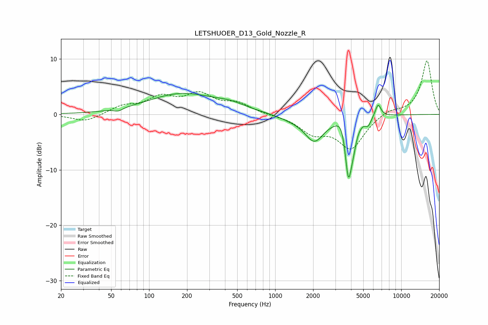

# LETSHUOER_D13_Gold_Nozzle_R
See [usage instructions](https://github.com/jaakkopasanen/AutoEq#usage) for more options and info.

### Parametric EQs
Apply preamp of -3.9 dB when using parametric equalizer.

|   # | Type    |   Fc (Hz) |    Q |   Gain (dB) |
|-----|---------|-----------|------|-------------|
|   1 | Peaking |        57 | 4.3  |        -0.5 |
|   2 | Peaking |       181 | 0.52 |         3.7 |
|   3 | Peaking |       445 | 1.12 |         1   |
|   4 | Peaking |      1347 | 1.31 |        -0.6 |
|   5 | Peaking |      2044 | 1.84 |        -4.5 |
|   6 | Peaking |      3407 | 3.5  |         2.5 |
|   7 | Peaking |      3808 | 4.84 |       -11.2 |
|   8 | Peaking |      4162 | 5.68 |        -2.1 |
|   9 | Peaking |      5466 | 6    |        -1.3 |
|  10 | Peaking |      6552 | 5.99 |         2.3 |

### Fixed Band EQs
When using fixed band (also called graphic) equalizer, apply preamp of **-9.8 dB** (if available) and set gains manually with these parameters.

|   # | Type    |   Fc (Hz) |    Q |   Gain (dB) |
|-----|---------|-----------|------|-------------|
|   1 | Peaking |        31 | 1.41 |        -1.4 |
|   2 | Peaking |        62 | 1.41 |         1.4 |
|   3 | Peaking |       125 | 1.41 |         2.8 |
|   4 | Peaking |       250 | 1.41 |         3.3 |
|   5 | Peaking |       500 | 1.41 |         1.8 |
|   6 | Peaking |      1000 | 1.41 |        -0.1 |
|   7 | Peaking |      2000 | 1.41 |        -3   |
|   8 | Peaking |      4000 | 1.41 |        -6   |
|   9 | Peaking |      8000 | 1.41 |         0.9 |
|  10 | Peaking |     16000 | 1.41 |         9.7 |

### Graphs

