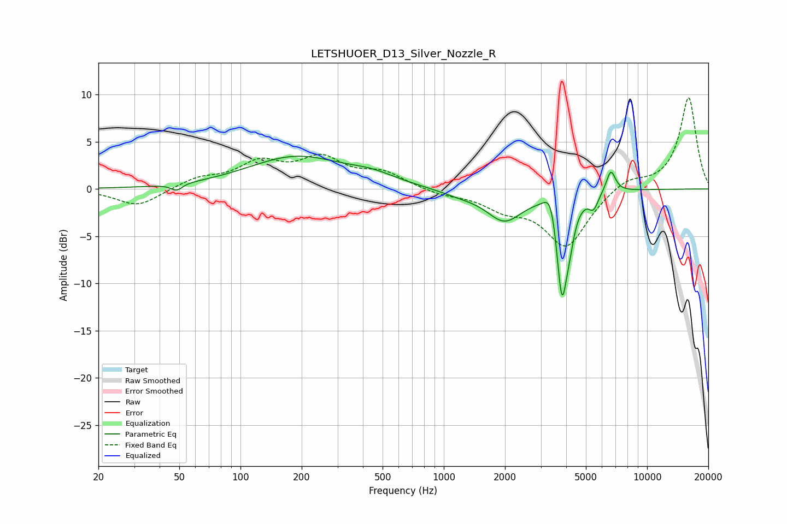

# LETSHUOER_D13_Silver_Nozzle_R
See [usage instructions](https://github.com/jaakkopasanen/AutoEq#usage) for more options and info.

### Parametric EQs
Apply preamp of -3.6 dB when using parametric equalizer.

|   # | Type    |   Fc (Hz) |    Q |   Gain (dB) |
|-----|---------|-----------|------|-------------|
|   1 | Peaking |        49 | 5.26 |        -0.7 |
|   2 | Peaking |       188 | 0.6  |         3.4 |
|   3 | Peaking |       446 | 1.22 |         0.8 |
|   4 | Peaking |      1198 | 1.36 |        -0.5 |
|   5 | Peaking |      1988 | 1.6  |        -3.2 |
|   6 | Peaking |      3373 | 4.37 |         2.9 |
|   7 | Peaking |      3809 | 5.1  |       -11.1 |
|   8 | Peaking |      4161 | 6    |        -2   |
|   9 | Peaking |      5454 | 6    |        -1.5 |
|  10 | Peaking |      6633 | 5.97 |         2.4 |

### Fixed Band EQs
When using fixed band (also called graphic) equalizer, apply preamp of **-9.7 dB** (if available) and set gains manually with these parameters.

|   # | Type    |   Fc (Hz) |    Q |   Gain (dB) |
|-----|---------|-----------|------|-------------|
|   1 | Peaking |        31 | 1.41 |        -1.9 |
|   2 | Peaking |        62 | 1.41 |         1   |
|   3 | Peaking |       125 | 1.41 |         2.5 |
|   4 | Peaking |       250 | 1.41 |         2.9 |
|   5 | Peaking |       500 | 1.41 |         1.6 |
|   6 | Peaking |      1000 | 1.41 |        -0.5 |
|   7 | Peaking |      2000 | 1.41 |        -1.7 |
|   8 | Peaking |      4000 | 1.41 |        -6   |
|   9 | Peaking |      8000 | 1.41 |         1.2 |
|  10 | Peaking |     16000 | 1.41 |         9.7 |

### Graphs

