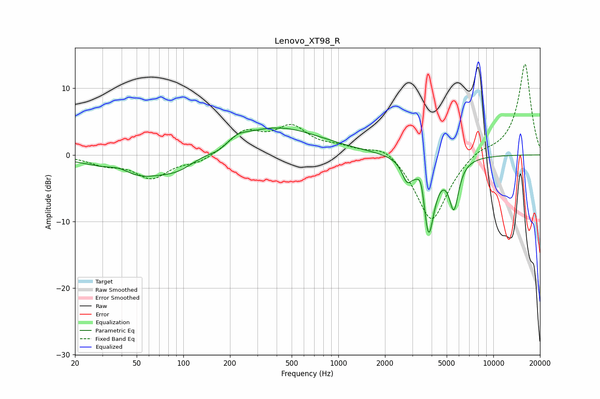

# Lenovo_XT98_R
See [usage instructions](https://github.com/jaakkopasanen/AutoEq#usage) for more options and info.

### Parametric EQs
Apply preamp of -4.1 dB when using parametric equalizer.

|   # | Type    |   Fc (Hz) |    Q |   Gain (dB) |
|-----|---------|-----------|------|-------------|
|   1 | Peaking |        39 | 1.91 |         1   |
|   2 | Peaking |        51 | 0.65 |        -3.5 |
|   3 | Peaking |        94 | 1.44 |        -1.2 |
|   4 | Peaking |       170 | 2.09 |        -0.8 |
|   5 | Peaking |       221 | 2.23 |         0.9 |
|   6 | Peaking |       396 | 0.49 |         4.2 |
|   7 | Peaking |      2770 | 4.52 |        -2.6 |
|   8 | Peaking |      3428 | 6    |         3.2 |
|   9 | Peaking |      3815 | 3.64 |       -12.2 |
|  10 | Peaking |      5568 | 4.47 |        -6.9 |

### Fixed Band EQs
When using fixed band (also called graphic) equalizer, apply preamp of **-13.7 dB** (if available) and set gains manually with these parameters.

|   # | Type    |   Fc (Hz) |    Q |   Gain (dB) |
|-----|---------|-----------|------|-------------|
|   1 | Peaking |        31 | 1.41 |        -1.2 |
|   2 | Peaking |        62 | 1.41 |        -3.3 |
|   3 | Peaking |       125 | 1.41 |        -1.1 |
|   4 | Peaking |       250 | 1.41 |         3.3 |
|   5 | Peaking |       500 | 1.41 |         3.9 |
|   6 | Peaking |      1000 | 1.41 |         0.9 |
|   7 | Peaking |      2000 | 1.41 |         1.8 |
|   8 | Peaking |      4000 | 1.41 |       -10.3 |
|   9 | Peaking |      8000 | 1.41 |         1   |
|  10 | Peaking |     16000 | 1.41 |        13.8 |

### Graphs

