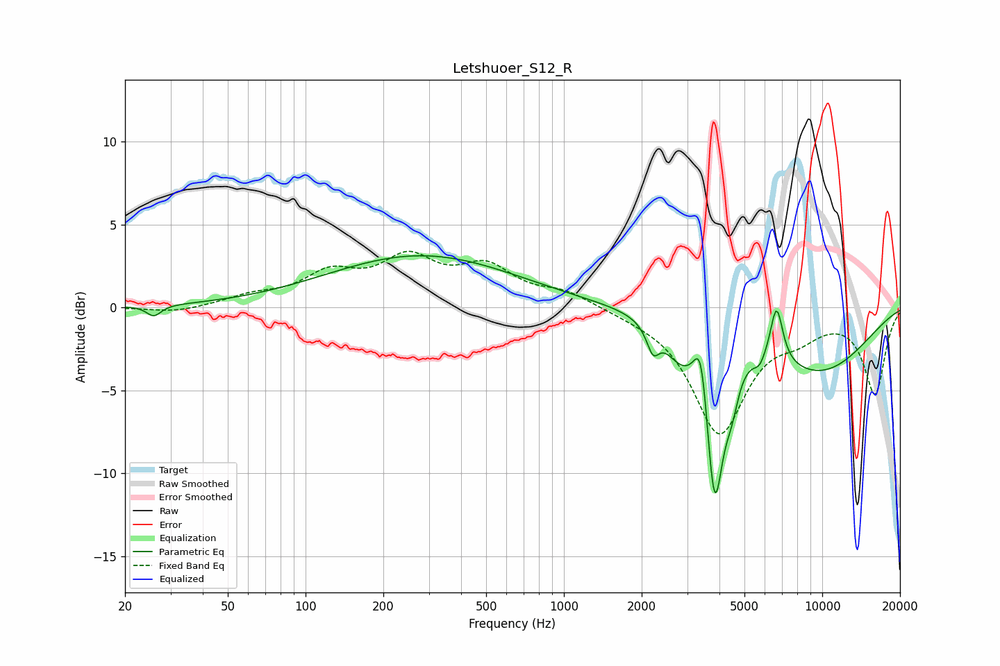

# Letshuoer_S12_R
See [usage instructions](https://github.com/jaakkopasanen/AutoEq#usage) for more options and info.

### Parametric EQs
Apply preamp of -3.2 dB when using parametric equalizer.

|   # | Type    |   Fc (Hz) |    Q |   Gain (dB) |
|-----|---------|-----------|------|-------------|
|   1 | Peaking |        26 | 5.15 |        -0.7 |
|   2 | Peaking |       282 | 0.39 |         3.1 |
|   3 | Peaking |      2211 | 5.93 |        -1.5 |
|   4 | Peaking |      2842 | 2.15 |        -1.9 |
|   5 | Peaking |      3396 | 5.49 |         3.5 |
|   6 | Peaking |      3831 | 4.14 |       -10   |
|   7 | Peaking |      4463 | 5.18 |        -1.9 |
|   8 | Peaking |      5721 | 6    |        -0.7 |
|   9 | Peaking |      6656 | 5.59 |         3.4 |
|  10 | Peaking |      9560 | 0.55 |        -3.8 |

### Fixed Band EQs
When using fixed band (also called graphic) equalizer, apply preamp of **-3.5 dB** (if available) and set gains manually with these parameters.

|   # | Type    |   Fc (Hz) |    Q |   Gain (dB) |
|-----|---------|-----------|------|-------------|
|   1 | Peaking |        31 | 1.41 |        -0.3 |
|   2 | Peaking |        62 | 1.41 |         0.6 |
|   3 | Peaking |       125 | 1.41 |         1.8 |
|   4 | Peaking |       250 | 1.41 |         2.6 |
|   5 | Peaking |       500 | 1.41 |         2.2 |
|   6 | Peaking |      1000 | 1.41 |         0.9 |
|   7 | Peaking |      2000 | 1.41 |        -0.2 |
|   8 | Peaking |      4000 | 1.41 |        -7.4 |
|   9 | Peaking |      8000 | 1.41 |        -1.1 |
|  10 | Peaking |     16000 | 1.41 |        -5.1 |

### Graphs

