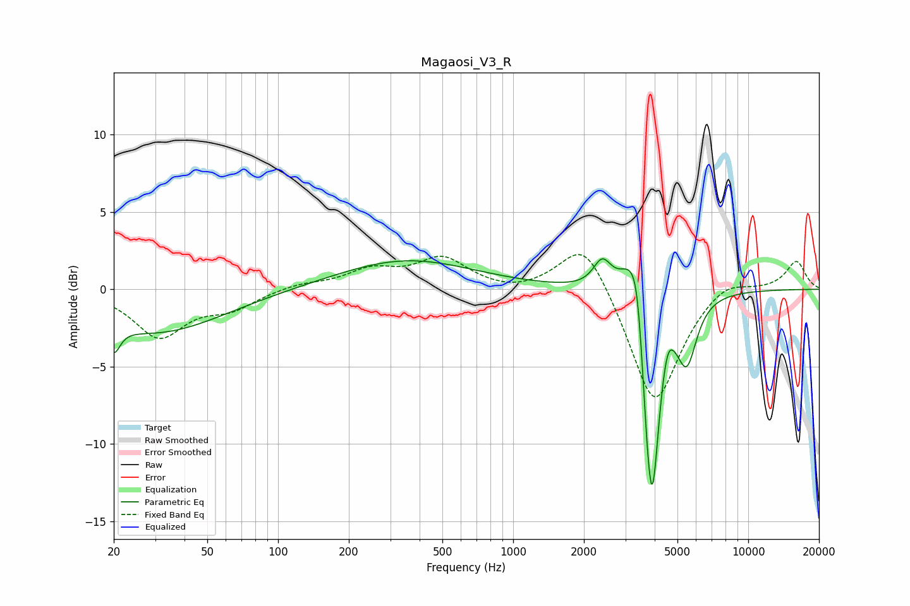

# Magaosi_V3_R
See [usage instructions](https://github.com/jaakkopasanen/AutoEq#usage) for more options and info.

### Parametric EQs
Apply preamp of -2.1 dB when using parametric equalizer.

|   # | Type    |   Fc (Hz) |    Q |   Gain (dB) |
|-----|---------|-----------|------|-------------|
|   1 | Peaking |        20 | 5.39 |        -1.7 |
|   2 | Peaking |        30 | 0.5  |        -2.8 |
|   3 | Peaking |       351 | 0.49 |         1.9 |
|   4 | Peaking |      2395 | 3.71 |         1.8 |
|   5 | Peaking |      3235 | 2.73 |         3.5 |
|   6 | Peaking |      3388 | 6    |         2   |
|   7 | Peaking |      3705 | 5.97 |        -2.8 |
|   8 | Peaking |      3906 | 4.26 |       -12.8 |
|   9 | Peaking |      4535 | 6    |         1.2 |
|  10 | Peaking |      5480 | 3.29 |        -4   |

### Fixed Band EQs
When using fixed band (also called graphic) equalizer, apply preamp of **-2.3 dB** (if available) and set gains manually with these parameters.

|   # | Type    |   Fc (Hz) |    Q |   Gain (dB) |
|-----|---------|-----------|------|-------------|
|   1 | Peaking |        31 | 1.41 |        -3   |
|   2 | Peaking |        62 | 1.41 |        -1.1 |
|   3 | Peaking |       125 | 1.41 |         0.4 |
|   4 | Peaking |       250 | 1.41 |         1.1 |
|   5 | Peaking |       500 | 1.41 |         1.9 |
|   6 | Peaking |      1000 | 1.41 |        -0.3 |
|   7 | Peaking |      2000 | 1.41 |         3.5 |
|   8 | Peaking |      4000 | 1.41 |        -7.7 |
|   9 | Peaking |      8000 | 1.41 |         0.9 |
|  10 | Peaking |     16000 | 1.41 |         1.8 |

### Graphs

