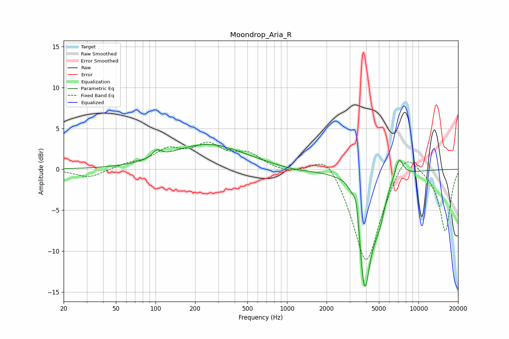

# Moondrop_Aria_R
See [usage instructions](https://github.com/jaakkopasanen/AutoEq#usage) for more options and info.

### Parametric EQs
Apply preamp of -3.1 dB when using parametric equalizer.

|   # | Type    |   Fc (Hz) |    Q |   Gain (dB) |
|-----|---------|-----------|------|-------------|
|   1 | Peaking |       102 | 4.41 |         0.9 |
|   2 | Peaking |       249 | 0.51 |         3   |
|   3 | Peaking |      1140 | 1.18 |        -0.3 |
|   4 | Peaking |      2939 | 2.12 |         1.3 |
|   5 | Peaking |      3384 | 5.95 |         3.2 |
|   6 | Peaking |      3719 | 6    |        -1.4 |
|   7 | Peaking |      3918 | 2.78 |       -14   |
|   8 | Peaking |      4659 | 4.6  |        -1   |
|   9 | Peaking |      5130 | 3.56 |        -2.7 |
|  10 | Peaking |      7110 | 4.19 |         2.5 |

### Fixed Band EQs
When using fixed band (also called graphic) equalizer, apply preamp of **-3.4 dB** (if available) and set gains manually with these parameters.

|   # | Type    |   Fc (Hz) |    Q |   Gain (dB) |
|-----|---------|-----------|------|-------------|
|   1 | Peaking |        31 | 1.41 |        -1.1 |
|   2 | Peaking |        62 | 1.41 |         0.5 |
|   3 | Peaking |       125 | 1.41 |         2.1 |
|   4 | Peaking |       250 | 1.41 |         2.6 |
|   5 | Peaking |       500 | 1.41 |         1.7 |
|   6 | Peaking |      1000 | 1.41 |        -0.4 |
|   7 | Peaking |      2000 | 1.41 |         2.6 |
|   8 | Peaking |      4000 | 1.41 |       -11.9 |
|   9 | Peaking |      8000 | 1.41 |         3.2 |
|  10 | Peaking |     16000 | 1.41 |        -7.6 |

### Graphs

