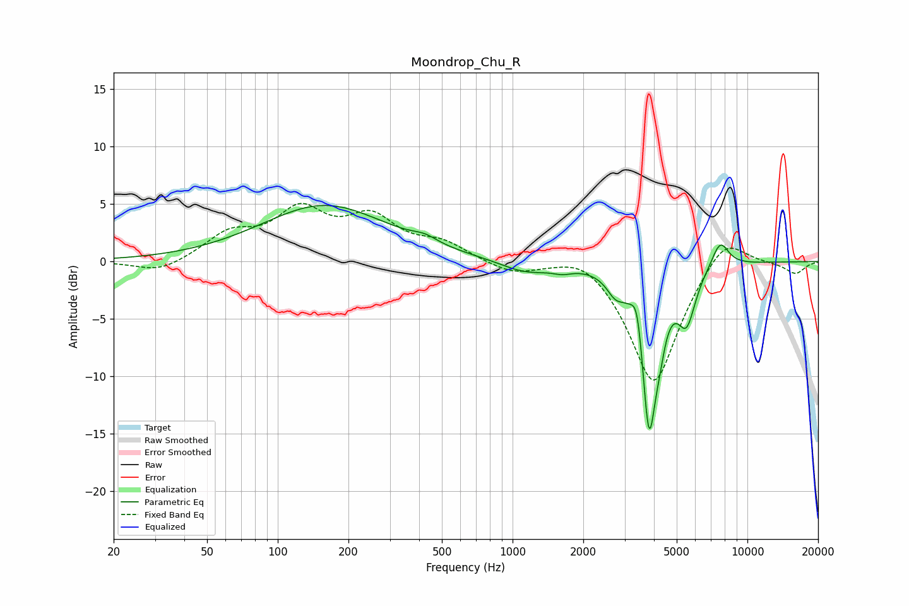

# Moondrop_Chu_R
See [usage instructions](https://github.com/jaakkopasanen/AutoEq#usage) for more options and info.

### Parametric EQs
Apply preamp of -5.0 dB when using parametric equalizer.

|   # | Type    |   Fc (Hz) |    Q |   Gain (dB) |
|-----|---------|-----------|------|-------------|
|   1 | Peaking |       158 | 0.53 |         4.9 |
|   2 | Peaking |       423 | 2.64 |         0.5 |
|   3 | Peaking |      1132 | 1.35 |        -1   |
|   4 | Peaking |      1628 | 3.3  |        -0.4 |
|   5 | Peaking |      2740 | 3.76 |        -1.4 |
|   6 | Peaking |      3398 | 6    |         3.2 |
|   7 | Peaking |      3811 | 4.11 |       -14.4 |
|   8 | Peaking |      4233 | 6    |        -1.7 |
|   9 | Peaking |      5510 | 3.63 |        -4.3 |
|  10 | Peaking |      7653 | 3.61 |         2.3 |

### Fixed Band EQs
When using fixed band (also called graphic) equalizer, apply preamp of **-5.2 dB** (if available) and set gains manually with these parameters.

|   # | Type    |   Fc (Hz) |    Q |   Gain (dB) |
|-----|---------|-----------|------|-------------|
|   1 | Peaking |        31 | 1.41 |        -1.1 |
|   2 | Peaking |        62 | 1.41 |         2.2 |
|   3 | Peaking |       125 | 1.41 |         4   |
|   4 | Peaking |       250 | 1.41 |         3.4 |
|   5 | Peaking |       500 | 1.41 |         1.4 |
|   6 | Peaking |      1000 | 1.41 |        -1   |
|   7 | Peaking |      2000 | 1.41 |         1.3 |
|   8 | Peaking |      4000 | 1.41 |       -10.9 |
|   9 | Peaking |      8000 | 1.41 |         2.8 |
|  10 | Peaking |     16000 | 1.41 |        -1   |

### Graphs

