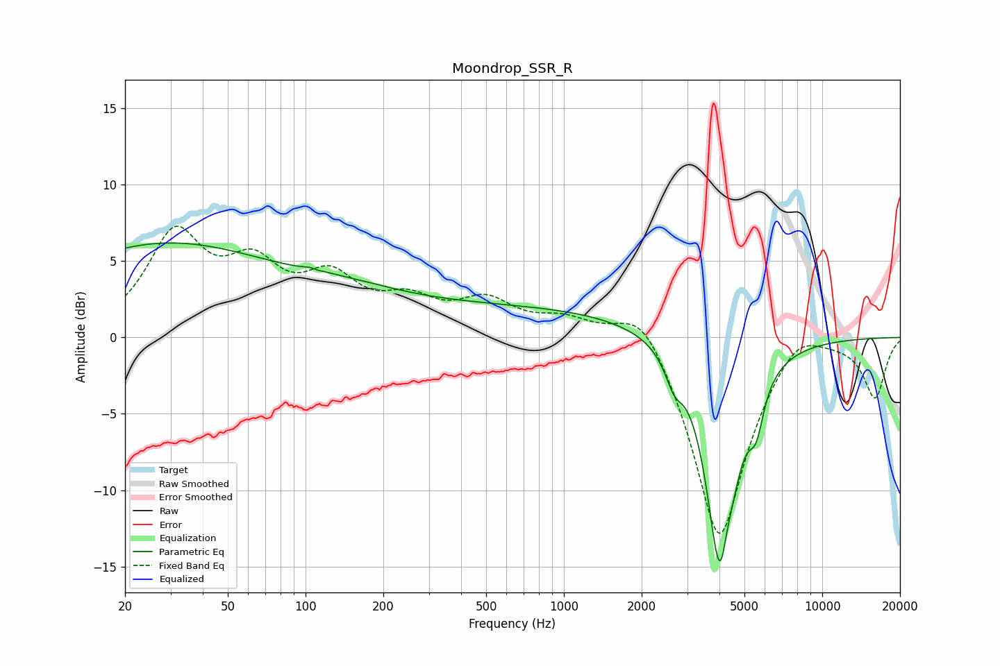

# Moondrop_SSR_R
See [usage instructions](https://github.com/jaakkopasanen/AutoEq#usage) for more options and info.

### Parametric EQs
Apply preamp of -6.3 dB when using parametric equalizer.

|   # | Type    |   Fc (Hz) |    Q |   Gain (dB) |
|-----|---------|-----------|------|-------------|
|   1 | Peaking |        28 | 0.3  |         6   |
|   2 | Peaking |       109 | 5.81 |         3.2 |
|   3 | Peaking |       109 | 5.99 |        -3.1 |
|   4 | Peaking |       145 | 0.68 |         1   |
|   5 | Peaking |       604 | 0.23 |         2   |
|   6 | Peaking |      2671 | 4.14 |        -1.7 |
|   7 | Peaking |      4004 | 3.12 |        -3.1 |
|   8 | Peaking |      4104 | 2.5  |       -14.5 |
|   9 | Peaking |      4228 | 5.78 |         3.3 |
|  10 | Peaking |      5552 | 4.9  |        -2.6 |

### Fixed Band EQs
When using fixed band (also called graphic) equalizer, apply preamp of **-7.4 dB** (if available) and set gains manually with these parameters.

|   # | Type    |   Fc (Hz) |    Q |   Gain (dB) |
|-----|---------|-----------|------|-------------|
|   1 | Peaking |        31 | 1.41 |         6.4 |
|   2 | Peaking |        62 | 1.41 |         3.9 |
|   3 | Peaking |       125 | 1.41 |         3.3 |
|   4 | Peaking |       250 | 1.41 |         1.9 |
|   5 | Peaking |       500 | 1.41 |         2.1 |
|   6 | Peaking |      1000 | 1.41 |         1.1 |
|   7 | Peaking |      2000 | 1.41 |         2.9 |
|   8 | Peaking |      4000 | 1.41 |       -13.6 |
|   9 | Peaking |      8000 | 1.41 |         1.6 |
|  10 | Peaking |     16000 | 1.41 |        -3.9 |

### Graphs

