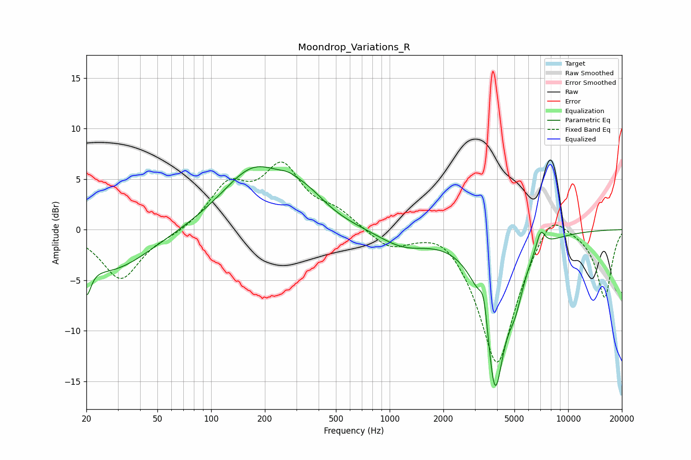

# Moondrop_Variations_R
See [usage instructions](https://github.com/jaakkopasanen/AutoEq#usage) for more options and info.

### Parametric EQs
Apply preamp of -6.3 dB when using parametric equalizer.

|   # | Type    |   Fc (Hz) |    Q |   Gain (dB) |
|-----|---------|-----------|------|-------------|
|   1 | Peaking |        20 | 5.61 |        -3.1 |
|   2 | Peaking |        27 | 0.64 |        -4.1 |
|   3 | Peaking |       174 | 0.77 |         5.9 |
|   4 | Peaking |       268 | 2.74 |         0.6 |
|   5 | Peaking |       341 | 1.28 |         1.8 |
|   6 | Peaking |      1191 | 1.02 |        -1.6 |
|   7 | Peaking |      3373 | 5.97 |         3.2 |
|   8 | Peaking |      3886 | 2.4  |       -15.3 |
|   9 | Peaking |      5057 | 3.1  |        -3.1 |
|  10 | Peaking |      7014 | 5.57 |         1.9 |

### Fixed Band EQs
When using fixed band (also called graphic) equalizer, apply preamp of **-6.8 dB** (if available) and set gains manually with these parameters.

|   # | Type    |   Fc (Hz) |    Q |   Gain (dB) |
|-----|---------|-----------|------|-------------|
|   1 | Peaking |        31 | 1.41 |        -4.9 |
|   2 | Peaking |        62 | 1.41 |        -0.4 |
|   3 | Peaking |       125 | 1.41 |         4   |
|   4 | Peaking |       250 | 1.41 |         5.8 |
|   5 | Peaking |       500 | 1.41 |         1.5 |
|   6 | Peaking |      1000 | 1.41 |        -1.7 |
|   7 | Peaking |      2000 | 1.41 |         1.1 |
|   8 | Peaking |      4000 | 1.41 |       -13.6 |
|   9 | Peaking |      8000 | 1.41 |         3   |
|  10 | Peaking |     16000 | 1.41 |        -6.7 |

### Graphs

