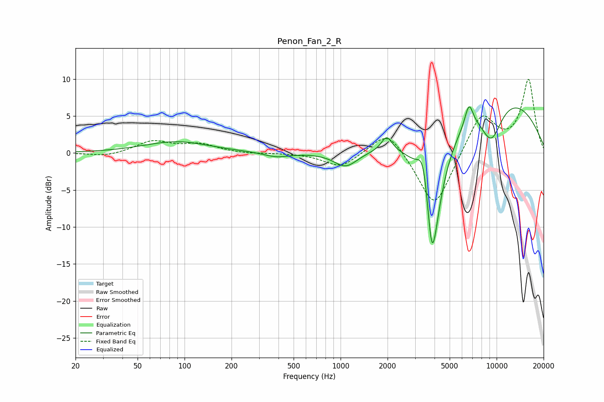

# Penon_Fan_2_R
See [usage instructions](https://github.com/jaakkopasanen/AutoEq#usage) for more options and info.

### Parametric EQs
Apply preamp of -6.3 dB when using parametric equalizer.

|   # | Type    |   Fc (Hz) |    Q |   Gain (dB) |
|-----|---------|-----------|------|-------------|
|   1 | Peaking |        89 | 0.68 |         1.5 |
|   2 | Peaking |       389 | 1.75 |        -0.6 |
|   3 | Peaking |      1079 | 1.87 |        -2.1 |
|   4 | Peaking |      1975 | 4.19 |         2   |
|   5 | Peaking |      3393 | 3.92 |         5   |
|   6 | Peaking |      3835 | 6    |        -4.8 |
|   7 | Peaking |      3931 | 2.03 |       -14.4 |
|   8 | Peaking |      6653 | 5.06 |         3.1 |
|   9 | Peaking |      9245 | 1.74 |        -5.6 |
|  10 | Peaking |      9709 | 0.32 |         8.3 |

### Fixed Band EQs
When using fixed band (also called graphic) equalizer, apply preamp of **-10.0 dB** (if available) and set gains manually with these parameters.

|   # | Type    |   Fc (Hz) |    Q |   Gain (dB) |
|-----|---------|-----------|------|-------------|
|   1 | Peaking |        31 | 1.41 |        -0.5 |
|   2 | Peaking |        62 | 1.41 |         1.6 |
|   3 | Peaking |       125 | 1.41 |         1.1 |
|   4 | Peaking |       250 | 1.41 |        -0.1 |
|   5 | Peaking |       500 | 1.41 |         0   |
|   6 | Peaking |      1000 | 1.41 |        -2   |
|   7 | Peaking |      2000 | 1.41 |         3.5 |
|   8 | Peaking |      4000 | 1.41 |        -7.8 |
|   9 | Peaking |      8000 | 1.41 |         5.5 |
|  10 | Peaking |     16000 | 1.41 |         9.8 |

### Graphs

