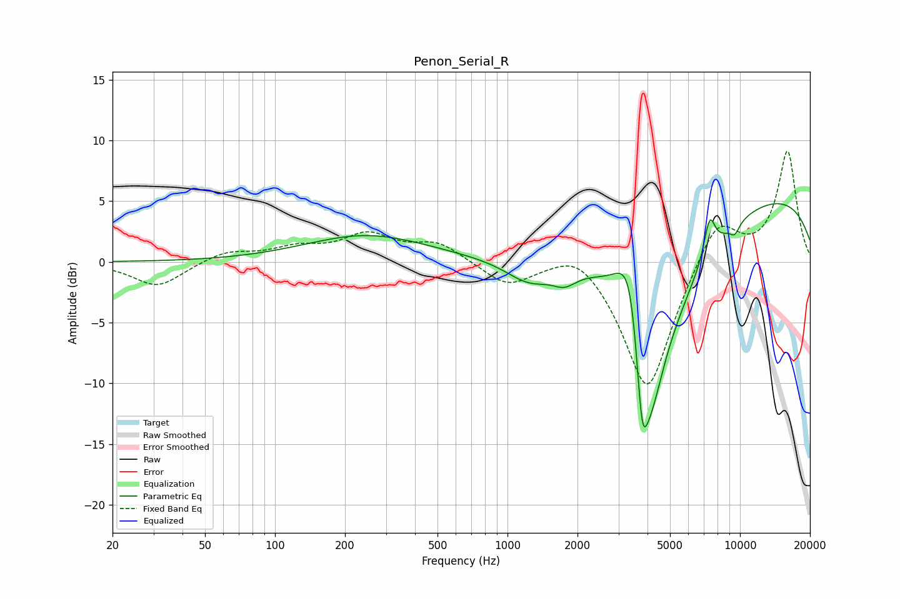

# Penon_Serial_R
See [usage instructions](https://github.com/jaakkopasanen/AutoEq#usage) for more options and info.

### Parametric EQs
Apply preamp of -4.9 dB when using parametric equalizer.

|   # | Type    |   Fc (Hz) |    Q |   Gain (dB) |
|-----|---------|-----------|------|-------------|
|   1 | Peaking |       249 | 0.54 |         2.2 |
|   2 | Peaking |      1241 | 1.37 |        -1.9 |
|   3 | Peaking |      1759 | 2.73 |        -1.1 |
|   4 | Peaking |      3406 | 2.19 |         8.9 |
|   5 | Peaking |      3786 | 6    |        -6.6 |
|   6 | Peaking |      4061 | 1.82 |       -13.2 |
|   7 | Peaking |      4517 | 0.64 |        -6.4 |
|   8 | Peaking |      7403 | 5.44 |         3.2 |
|   9 | Peaking |      9496 | 6    |        -0.9 |
|  10 | Peaking |      9666 | 0.19 |         6.1 |

### Fixed Band EQs
When using fixed band (also called graphic) equalizer, apply preamp of **-9.2 dB** (if available) and set gains manually with these parameters.

|   # | Type    |   Fc (Hz) |    Q |   Gain (dB) |
|-----|---------|-----------|------|-------------|
|   1 | Peaking |        31 | 1.41 |        -2.1 |
|   2 | Peaking |        62 | 1.41 |         0.9 |
|   3 | Peaking |       125 | 1.41 |         1   |
|   4 | Peaking |       250 | 1.41 |         2.1 |
|   5 | Peaking |       500 | 1.41 |         1.5 |
|   6 | Peaking |      1000 | 1.41 |        -1.9 |
|   7 | Peaking |      2000 | 1.41 |         1.7 |
|   8 | Peaking |      4000 | 1.41 |       -11   |
|   9 | Peaking |      8000 | 1.41 |         4   |
|  10 | Peaking |     16000 | 1.41 |         9.1 |

### Graphs

