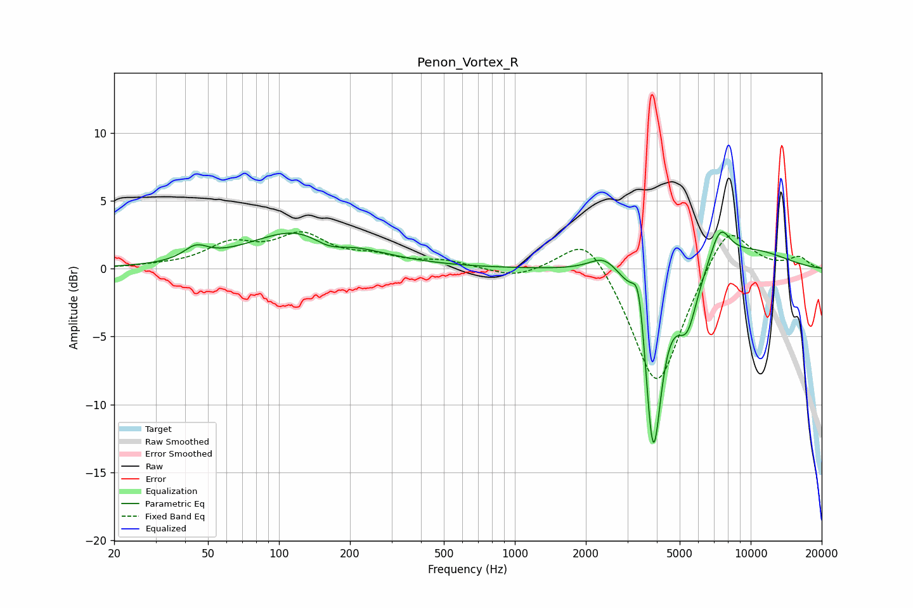

# Penon_Vortex_R
See [usage instructions](https://github.com/jaakkopasanen/AutoEq#usage) for more options and info.

### Parametric EQs
Apply preamp of -2.8 dB when using parametric equalizer.

|   # | Type    |   Fc (Hz) |    Q |   Gain (dB) |
|-----|---------|-----------|------|-------------|
|   1 | Peaking |        44 | 2.83 |         1   |
|   2 | Peaking |       129 | 0.66 |         3.1 |
|   3 | Peaking |       162 | 1.82 |        -1.1 |
|   4 | Peaking |      2402 | 2.23 |         1.3 |
|   5 | Peaking |      3355 | 5.56 |         3.4 |
|   6 | Peaking |      3750 | 6    |        -1.8 |
|   7 | Peaking |      3883 | 3.87 |       -12.2 |
|   8 | Peaking |      5373 | 3.06 |        -4   |
|   9 | Peaking |      7410 | 3.03 |         2.6 |
|  10 | Peaking |     10000 | 0.71 |         1.4 |

### Fixed Band EQs
When using fixed band (also called graphic) equalizer, apply preamp of **-2.8 dB** (if available) and set gains manually with these parameters.

|   # | Type    |   Fc (Hz) |    Q |   Gain (dB) |
|-----|---------|-----------|------|-------------|
|   1 | Peaking |        31 | 1.41 |         0.1 |
|   2 | Peaking |        62 | 1.41 |         1.7 |
|   3 | Peaking |       125 | 1.41 |         2.3 |
|   4 | Peaking |       250 | 1.41 |         0.7 |
|   5 | Peaking |       500 | 1.41 |         0.5 |
|   6 | Peaking |      1000 | 1.41 |        -0.7 |
|   7 | Peaking |      2000 | 1.41 |         3   |
|   8 | Peaking |      4000 | 1.41 |        -9.2 |
|   9 | Peaking |      8000 | 1.41 |         3.7 |
|  10 | Peaking |     16000 | 1.41 |         0.8 |

### Graphs

