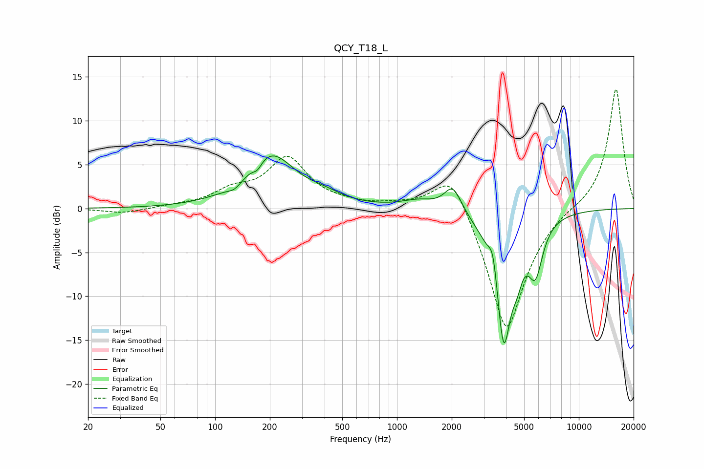

# QCY_T18_L
See [usage instructions](https://github.com/jaakkopasanen/AutoEq#usage) for more options and info.

### Parametric EQs
Apply preamp of -6.1 dB when using parametric equalizer.

|   # | Type    |   Fc (Hz) |    Q |   Gain (dB) |
|-----|---------|-----------|------|-------------|
|   1 | Peaking |       129 | 3.43 |        -0.8 |
|   2 | Peaking |       171 | 5.42 |        -0.9 |
|   3 | Peaking |       201 | 1.06 |         6.1 |
|   4 | Peaking |       397 | 1.45 |         0.8 |
|   5 | Peaking |      1322 | 1.49 |         0.9 |
|   6 | Peaking |      2029 | 2.97 |         2.9 |
|   7 | Peaking |      3379 | 6    |         3.2 |
|   8 | Peaking |      3860 | 3.01 |       -15.3 |
|   9 | Peaking |      4580 | 4.97 |        -2.1 |
|  10 | Peaking |      5776 | 3.48 |        -5.5 |

### Fixed Band EQs
When using fixed band (also called graphic) equalizer, apply preamp of **-13.7 dB** (if available) and set gains manually with these parameters.

|   # | Type    |   Fc (Hz) |    Q |   Gain (dB) |
|-----|---------|-----------|------|-------------|
|   1 | Peaking |        31 | 1.41 |        -0.6 |
|   2 | Peaking |        62 | 1.41 |         0.2 |
|   3 | Peaking |       125 | 1.41 |         1.7 |
|   4 | Peaking |       250 | 1.41 |         5.5 |
|   5 | Peaking |       500 | 1.41 |         0.4 |
|   6 | Peaking |      1000 | 1.41 |         0.4 |
|   7 | Peaking |      2000 | 1.41 |         5.2 |
|   8 | Peaking |      4000 | 1.41 |       -14.6 |
|   9 | Peaking |      8000 | 1.41 |         0.4 |
|  10 | Peaking |     16000 | 1.41 |        13.9 |

### Graphs

