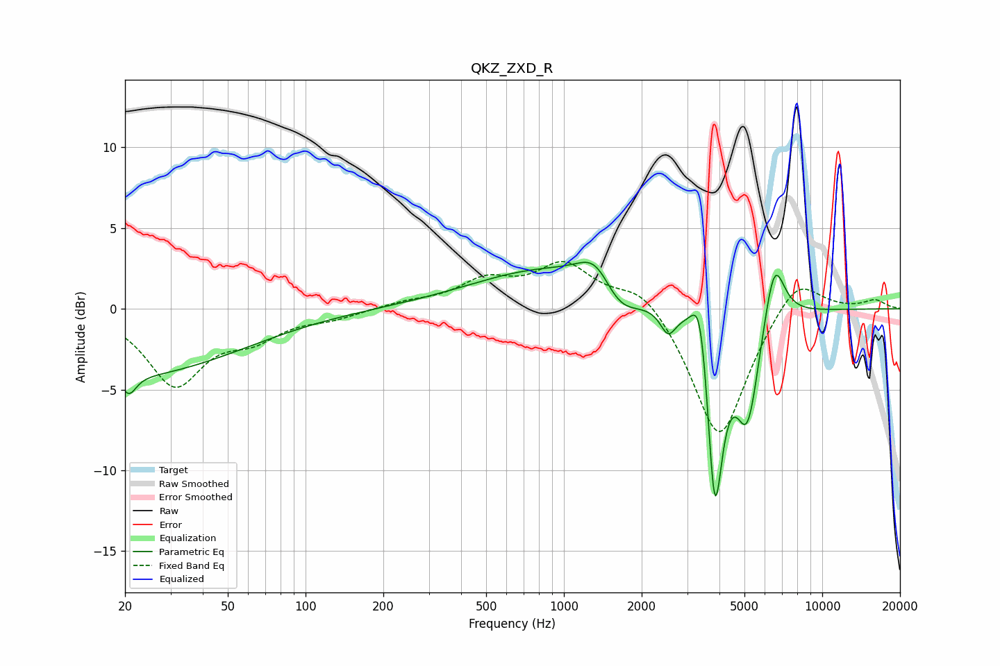

# QKZ_ZXD_R
See [usage instructions](https://github.com/jaakkopasanen/AutoEq#usage) for more options and info.

### Parametric EQs
Apply preamp of -3.0 dB when using parametric equalizer.

|   # | Type    |   Fc (Hz) |    Q |   Gain (dB) |
|-----|---------|-----------|------|-------------|
|   1 | Peaking |        20 | 0.32 |        -4.1 |
|   2 | Peaking |        21 | 5.31 |        -1.1 |
|   3 | Peaking |       873 | 0.48 |         2.5 |
|   4 | Peaking |      1341 | 1.98 |         2.3 |
|   5 | Peaking |      1604 | 1.68 |        -2.3 |
|   6 | Peaking |      2530 | 4.73 |        -1.5 |
|   7 | Peaking |      3379 | 4.21 |         4.5 |
|   8 | Peaking |      3835 | 4.3  |       -12.6 |
|   9 | Peaking |      5141 | 2.99 |        -6.6 |
|  10 | Peaking |      6517 | 3.38 |         4.2 |

### Fixed Band EQs
When using fixed band (also called graphic) equalizer, apply preamp of **-3.0 dB** (if available) and set gains manually with these parameters.

|   # | Type    |   Fc (Hz) |    Q |   Gain (dB) |
|-----|---------|-----------|------|-------------|
|   1 | Peaking |        31 | 1.41 |        -4.6 |
|   2 | Peaking |        62 | 1.41 |        -1.5 |
|   3 | Peaking |       125 | 1.41 |        -0.5 |
|   4 | Peaking |       250 | 1.41 |         0.4 |
|   5 | Peaking |       500 | 1.41 |         1.6 |
|   6 | Peaking |      1000 | 1.41 |         2.6 |
|   7 | Peaking |      2000 | 1.41 |         1.6 |
|   8 | Peaking |      4000 | 1.41 |        -8.3 |
|   9 | Peaking |      8000 | 1.41 |         2.3 |
|  10 | Peaking |     16000 | 1.41 |         0.5 |

### Graphs

