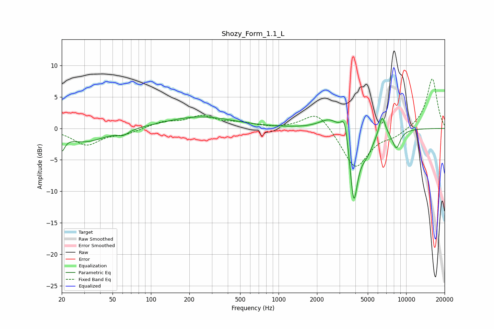

# Shozy_Form_1.1_L
See [usage instructions](https://github.com/jaakkopasanen/AutoEq#usage) for more options and info.

### Parametric EQs
Apply preamp of -1.9 dB when using parametric equalizer.

|   # | Type    |   Fc (Hz) |    Q |   Gain (dB) |
|-----|---------|-----------|------|-------------|
|   1 | Peaking |        20 | 5.94 |        -2.3 |
|   2 | Peaking |        31 | 0.91 |        -2.1 |
|   3 | Peaking |        61 | 3.28 |        -0.7 |
|   4 | Peaking |       240 | 0.53 |         1.9 |
|   5 | Peaking |      2533 | 1.75 |         1.9 |
|   6 | Peaking |      3302 | 4.96 |         3.9 |
|   7 | Peaking |      3881 | 4.36 |       -11.4 |
|   8 | Peaking |      4868 | 2.4  |        -3.1 |
|   9 | Peaking |      6472 | 5.47 |         3.2 |
|  10 | Peaking |      8371 | 4.1  |        -2.9 |

### Fixed Band EQs
When using fixed band (also called graphic) equalizer, apply preamp of **-8.0 dB** (if available) and set gains manually with these parameters.

|   # | Type    |   Fc (Hz) |    Q |   Gain (dB) |
|-----|---------|-----------|------|-------------|
|   1 | Peaking |        31 | 1.41 |        -2.6 |
|   2 | Peaking |        62 | 1.41 |        -0.7 |
|   3 | Peaking |       125 | 1.41 |         1   |
|   4 | Peaking |       250 | 1.41 |         1.8 |
|   5 | Peaking |       500 | 1.41 |         0.7 |
|   6 | Peaking |      1000 | 1.41 |        -0.1 |
|   7 | Peaking |      2000 | 1.41 |         3   |
|   8 | Peaking |      4000 | 1.41 |        -6.5 |
|   9 | Peaking |      8000 | 1.41 |        -1   |
|  10 | Peaking |     16000 | 1.41 |         8   |

### Graphs

