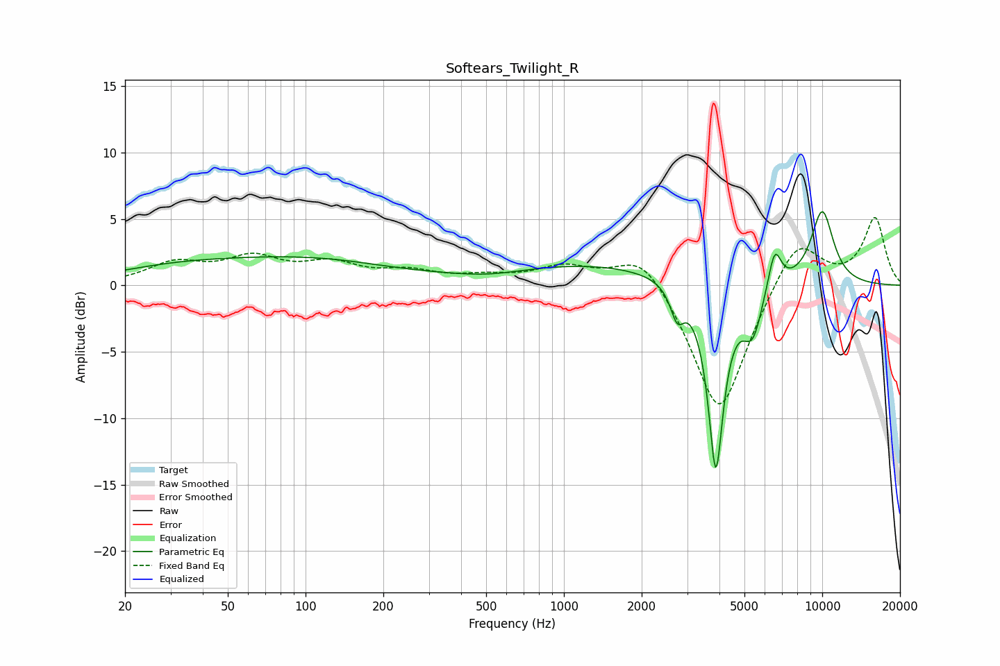

# Softears_Twilight_R
See [usage instructions](https://github.com/jaakkopasanen/AutoEq#usage) for more options and info.

### Parametric EQs
Apply preamp of -5.7 dB when using parametric equalizer.

|   # | Type    |   Fc (Hz) |    Q |   Gain (dB) |
|-----|---------|-----------|------|-------------|
|   1 | Peaking |        30 | 0.58 |         0.9 |
|   2 | Peaking |        96 | 0.42 |         1.8 |
|   3 | Peaking |       138 | 1.29 |         0   |
|   4 | Peaking |       515 | 1.1  |        -0.4 |
|   5 | Peaking |      1280 | 0.41 |         1.6 |
|   6 | Peaking |      2747 | 5.39 |        -2.3 |
|   7 | Peaking |      3873 | 4.5  |       -14.1 |
|   8 | Peaking |      5373 | 3.58 |        -3.5 |
|   9 | Peaking |      6543 | 5.23 |         3.1 |
|  10 | Peaking |     10000 | 2.67 |         5.6 |

### Fixed Band EQs
When using fixed band (also called graphic) equalizer, apply preamp of **-5.2 dB** (if available) and set gains manually with these parameters.

|   # | Type    |   Fc (Hz) |    Q |   Gain (dB) |
|-----|---------|-----------|------|-------------|
|   1 | Peaking |        31 | 1.41 |         1.5 |
|   2 | Peaking |        62 | 1.41 |         1.8 |
|   3 | Peaking |       125 | 1.41 |         1.4 |
|   4 | Peaking |       250 | 1.41 |         0.9 |
|   5 | Peaking |       500 | 1.41 |         0.5 |
|   6 | Peaking |      1000 | 1.41 |         1.3 |
|   7 | Peaking |      2000 | 1.41 |         2.8 |
|   8 | Peaking |      4000 | 1.41 |       -10.1 |
|   9 | Peaking |      8000 | 1.41 |         3.9 |
|  10 | Peaking |     16000 | 1.41 |         5   |

### Graphs

