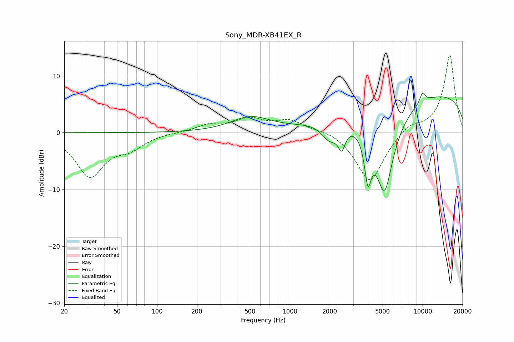

# Sony_MDR-XB41EX_R
See [usage instructions](https://github.com/jaakkopasanen/AutoEq#usage) for more options and info.

### Parametric EQs
Apply preamp of -7.1 dB when using parametric equalizer.

|   # | Type    |   Fc (Hz) |    Q |   Gain (dB) |
|-----|---------|-----------|------|-------------|
|   1 | Peaking |       505 | 0.96 |         2.6 |
|   2 | Peaking |      1985 | 2.37 |        -3   |
|   3 | Peaking |      2383 | 5.97 |         2   |
|   4 | Peaking |      2428 | 5.12 |        -5.6 |
|   5 | Peaking |      3870 | 5.54 |        -7.6 |
|   6 | Peaking |      4665 | 2.47 |        -0.6 |
|   7 | Peaking |      5170 | 1.76 |       -15.2 |
|   8 | Peaking |      5443 | 4.7  |        -0.2 |
|   9 | Peaking |     10000 | 6    |         1.8 |
|  10 | Peaking |     10000 | 0.18 |         7.2 |

### Fixed Band EQs
When using fixed band (also called graphic) equalizer, apply preamp of **-13.8 dB** (if available) and set gains manually with these parameters.

|   # | Type    |   Fc (Hz) |    Q |   Gain (dB) |
|-----|---------|-----------|------|-------------|
|   1 | Peaking |        31 | 1.41 |        -7.5 |
|   2 | Peaking |        62 | 1.41 |        -2.2 |
|   3 | Peaking |       125 | 1.41 |         0.1 |
|   4 | Peaking |       250 | 1.41 |         1.3 |
|   5 | Peaking |       500 | 1.41 |         2.2 |
|   6 | Peaking |      1000 | 1.41 |         2.1 |
|   7 | Peaking |      2000 | 1.41 |         0.7 |
|   8 | Peaking |      4000 | 1.41 |        -8.9 |
|   9 | Peaking |      8000 | 1.41 |         1.6 |
|  10 | Peaking |     16000 | 1.41 |        13.8 |

### Graphs

