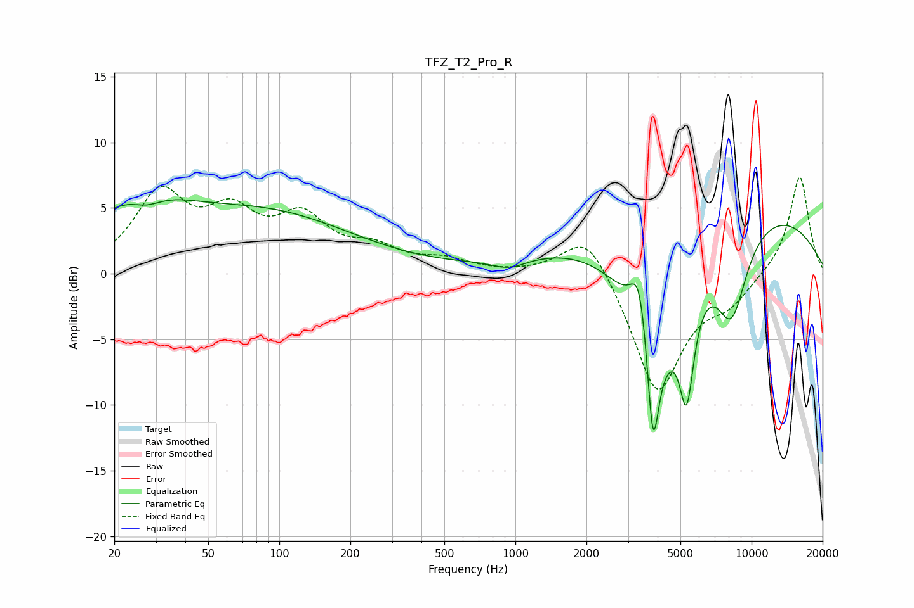

# TFZ_T2_Pro_R
See [usage instructions](https://github.com/jaakkopasanen/AutoEq#usage) for more options and info.

### Parametric EQs
Apply preamp of -5.7 dB when using parametric equalizer.

|   # | Type    |   Fc (Hz) |    Q |   Gain (dB) |
|-----|---------|-----------|------|-------------|
|   1 | Peaking |        25 | 0.7  |         4.7 |
|   2 | Peaking |        27 | 2    |        -1.2 |
|   3 | Peaking |        91 | 0.39 |         4.3 |
|   4 | Peaking |       939 | 1.88 |        -0.8 |
|   5 | Peaking |      3361 | 3.6  |         5.4 |
|   6 | Peaking |      3826 | 6    |        -8.1 |
|   7 | Peaking |      3914 | 1.1  |       -10.8 |
|   8 | Peaking |      5312 | 4.45 |        -7.7 |
|   9 | Peaking |      6898 | 0.21 |         6   |
|  10 | Peaking |      8232 | 1.92 |        -6.6 |

### Fixed Band EQs
When using fixed band (also called graphic) equalizer, apply preamp of **-7.4 dB** (if available) and set gains manually with these parameters.

|   # | Type    |   Fc (Hz) |    Q |   Gain (dB) |
|-----|---------|-----------|------|-------------|
|   1 | Peaking |        31 | 1.41 |         5.8 |
|   2 | Peaking |        62 | 1.41 |         3.9 |
|   3 | Peaking |       125 | 1.41 |         3.8 |
|   4 | Peaking |       250 | 1.41 |         1.6 |
|   5 | Peaking |       500 | 1.41 |         0.9 |
|   6 | Peaking |      1000 | 1.41 |        -0   |
|   7 | Peaking |      2000 | 1.41 |         3.6 |
|   8 | Peaking |      4000 | 1.41 |        -9.2 |
|   9 | Peaking |      8000 | 1.41 |        -1.8 |
|  10 | Peaking |     16000 | 1.41 |         7.5 |

### Graphs

