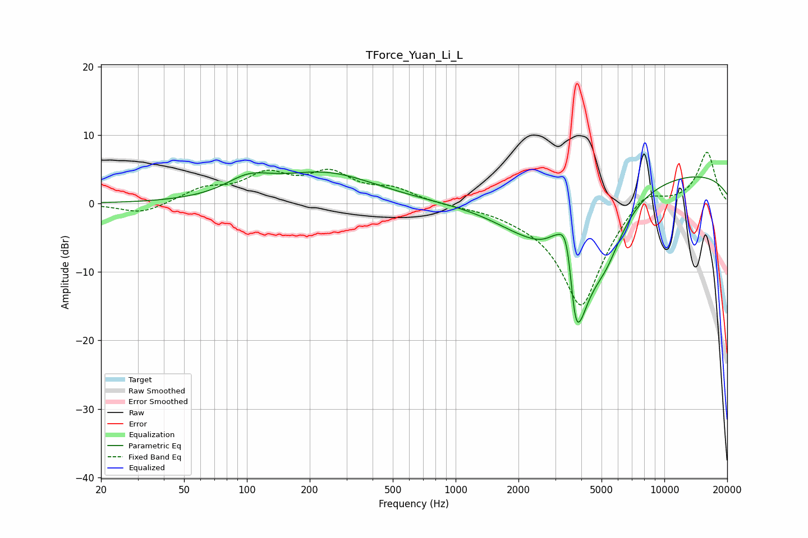

# TForce_Yuan_Li_L
See [usage instructions](https://github.com/jaakkopasanen/AutoEq#usage) for more options and info.

### Parametric EQs
Apply preamp of -4.7 dB when using parametric equalizer.

|   # | Type    |   Fc (Hz) |    Q |   Gain (dB) |
|-----|---------|-----------|------|-------------|
|   1 | Peaking |       102 | 1.31 |         2.4 |
|   2 | Peaking |       238 | 0.58 |         4.3 |
|   3 | Peaking |      2161 | 0.79 |        -3.4 |
|   4 | Peaking |      3009 | 2.8  |         2.4 |
|   5 | Peaking |      3362 | 3.99 |         4.8 |
|   6 | Peaking |      3498 | 4.27 |         4.1 |
|   7 | Peaking |      3720 | 6    |        -5.1 |
|   8 | Peaking |      3861 | 1.63 |       -18.2 |
|   9 | Peaking |      5248 | 1.7  |        -5.2 |
|  10 | Peaking |      9758 | 0.2  |         4.8 |

### Fixed Band EQs
When using fixed band (also called graphic) equalizer, apply preamp of **-7.6 dB** (if available) and set gains manually with these parameters.

|   # | Type    |   Fc (Hz) |    Q |   Gain (dB) |
|-----|---------|-----------|------|-------------|
|   1 | Peaking |        31 | 1.41 |        -1.6 |
|   2 | Peaking |        62 | 1.41 |         1.9 |
|   3 | Peaking |       125 | 1.41 |         3.8 |
|   4 | Peaking |       250 | 1.41 |         4   |
|   5 | Peaking |       500 | 1.41 |         1.9 |
|   6 | Peaking |      1000 | 1.41 |        -0.2 |
|   7 | Peaking |      2000 | 1.41 |        -0.6 |
|   8 | Peaking |      4000 | 1.41 |       -15.3 |
|   9 | Peaking |      8000 | 1.41 |         3   |
|  10 | Peaking |     16000 | 1.41 |         7.6 |

### Graphs

