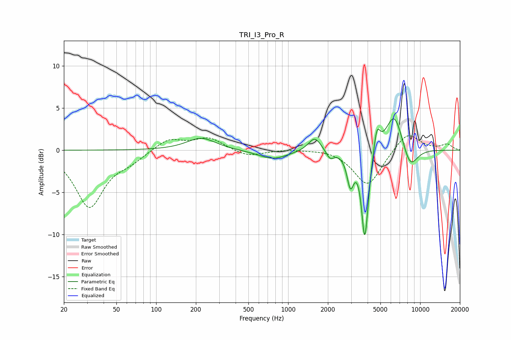

# TRI_I3_Pro_R
See [usage instructions](https://github.com/jaakkopasanen/AutoEq#usage) for more options and info.

### Parametric EQs
Apply preamp of -3.8 dB when using parametric equalizer.

|   # | Type    |   Fc (Hz) |    Q |   Gain (dB) |
|-----|---------|-----------|------|-------------|
|   1 | Peaking |       220 | 1.31 |         1.5 |
|   2 | Peaking |       766 | 1.27 |        -1.1 |
|   3 | Peaking |      1591 | 2.94 |         1.7 |
|   4 | Peaking |      2077 | 4.82 |        -1   |
|   5 | Peaking |      2963 | 5.46 |        -3.7 |
|   6 | Peaking |      3800 | 5.74 |        -9.8 |
|   7 | Peaking |      4012 | 6    |        -1.2 |
|   8 | Peaking |      4706 | 5.99 |         2.8 |
|   9 | Peaking |      6369 | 2.11 |         4.7 |
|  10 | Peaking |      8371 | 2.29 |        -2.7 |

### Fixed Band EQs
When using fixed band (also called graphic) equalizer, apply preamp of **-1.8 dB** (if available) and set gains manually with these parameters.

|   # | Type    |   Fc (Hz) |    Q |   Gain (dB) |
|-----|---------|-----------|------|-------------|
|   1 | Peaking |        31 | 1.41 |        -6.7 |
|   2 | Peaking |        62 | 1.41 |        -1   |
|   3 | Peaking |       125 | 1.41 |         1.4 |
|   4 | Peaking |       250 | 1.41 |         1.4 |
|   5 | Peaking |       500 | 1.41 |        -0.8 |
|   6 | Peaking |      1000 | 1.41 |         0.1 |
|   7 | Peaking |      2000 | 1.41 |         0.2 |
|   8 | Peaking |      4000 | 1.41 |        -4.3 |
|   9 | Peaking |      8000 | 1.41 |         2.3 |
|  10 | Peaking |     16000 | 1.41 |         0.7 |

### Graphs

