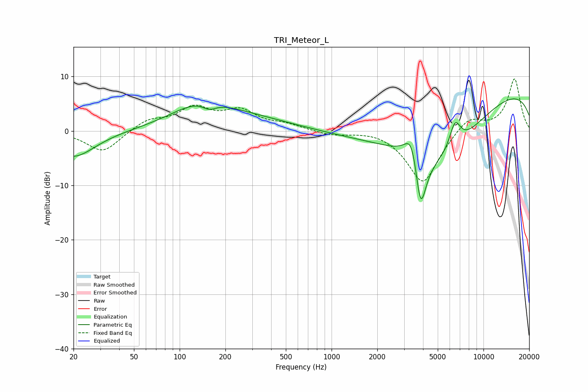

# TRI_Meteor_L
See [usage instructions](https://github.com/jaakkopasanen/AutoEq#usage) for more options and info.

### Parametric EQs
Apply preamp of -6.0 dB when using parametric equalizer.

|   # | Type    |   Fc (Hz) |    Q |   Gain (dB) |
|-----|---------|-----------|------|-------------|
|   1 | Peaking |        20 | 0.99 |        -4.9 |
|   2 | Peaking |       138 | 0.72 |         4.3 |
|   3 | Peaking |       157 | 2.93 |        -1.4 |
|   4 | Peaking |       297 | 0.47 |         1.8 |
|   5 | Peaking |      3382 | 3.05 |         6.4 |
|   6 | Peaking |      3854 | 3.5  |       -12   |
|   7 | Peaking |      3943 | 0.34 |        -6   |
|   8 | Peaking |      5477 | 0.65 |        -6.4 |
|   9 | Peaking |      6496 | 3.61 |         5   |
|  10 | Peaking |     10000 | 0.18 |         8.5 |

### Fixed Band EQs
When using fixed band (also called graphic) equalizer, apply preamp of **-9.6 dB** (if available) and set gains manually with these parameters.

|   # | Type    |   Fc (Hz) |    Q |   Gain (dB) |
|-----|---------|-----------|------|-------------|
|   1 | Peaking |        31 | 1.41 |        -4   |
|   2 | Peaking |        62 | 1.41 |         1.9 |
|   3 | Peaking |       125 | 1.41 |         3.9 |
|   4 | Peaking |       250 | 1.41 |         3.3 |
|   5 | Peaking |       500 | 1.41 |         1   |
|   6 | Peaking |      1000 | 1.41 |        -0.7 |
|   7 | Peaking |      2000 | 1.41 |         0.4 |
|   8 | Peaking |      4000 | 1.41 |        -9.8 |
|   9 | Peaking |      8000 | 1.41 |         2.9 |
|  10 | Peaking |     16000 | 1.41 |         9.6 |

### Graphs

