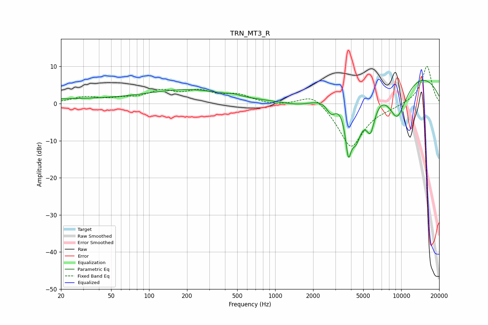

# TRN_MT3_R
See [usage instructions](https://github.com/jaakkopasanen/AutoEq#usage) for more options and info.

### Parametric EQs
Apply preamp of -6.4 dB when using parametric equalizer.

|   # | Type    |   Fc (Hz) |    Q |   Gain (dB) |
|-----|---------|-----------|------|-------------|
|   1 | Peaking |        20 | 0.22 |         1.1 |
|   2 | Peaking |       206 | 0.45 |         3.5 |
|   3 | Peaking |       470 | 3.4  |         0.4 |
|   4 | Peaking |      1693 | 0.77 |        -3.9 |
|   5 | Peaking |      2782 | 3.6  |        -3.9 |
|   6 | Peaking |      3804 | 6    |       -10.8 |
|   7 | Peaking |      4371 | 2.26 |       -13.6 |
|   8 | Peaking |      5702 | 3.51 |        -9.1 |
|   9 | Peaking |      8134 | 0.24 |        12.3 |
|  10 | Peaking |      9271 | 1.3  |       -14   |

### Fixed Band EQs
When using fixed band (also called graphic) equalizer, apply preamp of **-10.1 dB** (if available) and set gains manually with these parameters.

|   # | Type    |   Fc (Hz) |    Q |   Gain (dB) |
|-----|---------|-----------|------|-------------|
|   1 | Peaking |        31 | 1.41 |         1.6 |
|   2 | Peaking |        62 | 1.41 |         1   |
|   3 | Peaking |       125 | 1.41 |         3   |
|   4 | Peaking |       250 | 1.41 |         2.9 |
|   5 | Peaking |       500 | 1.41 |         2.2 |
|   6 | Peaking |      1000 | 1.41 |        -0.5 |
|   7 | Peaking |      2000 | 1.41 |         3.4 |
|   8 | Peaking |      4000 | 1.41 |       -12.1 |
|   9 | Peaking |      8000 | 1.41 |        -0.6 |
|  10 | Peaking |     16000 | 1.41 |        10.3 |

### Graphs

