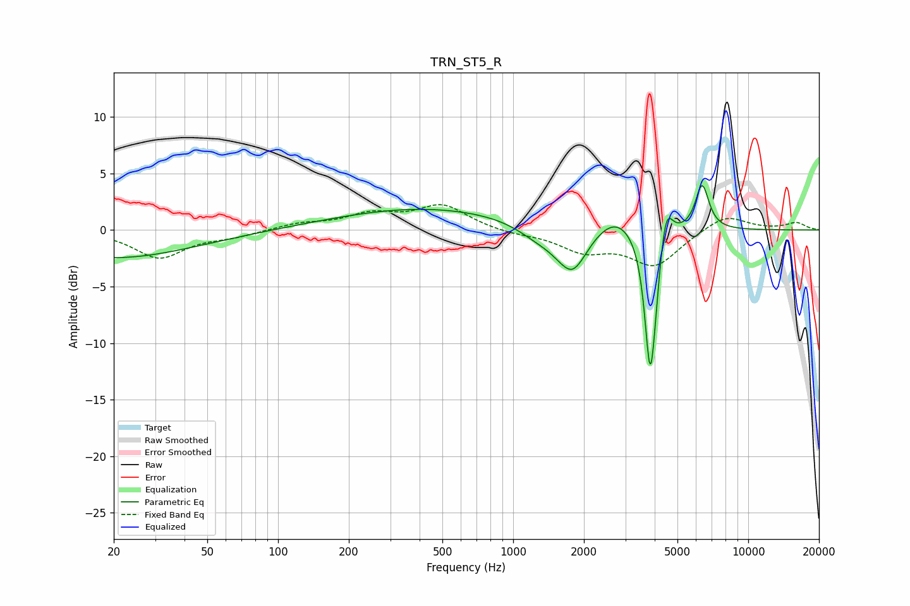

# TRN_ST5_R
See [usage instructions](https://github.com/jaakkopasanen/AutoEq#usage) for more options and info.

### Parametric EQs
Apply preamp of -4.0 dB when using parametric equalizer.

|   # | Type    |   Fc (Hz) |    Q |   Gain (dB) |
|-----|---------|-----------|------|-------------|
|   1 | Peaking |        20 | 0.41 |        -2.5 |
|   2 | Peaking |       428 | 0.37 |         2   |
|   3 | Peaking |      1263 | 1.6  |        -1   |
|   4 | Peaking |      1667 | 4.17 |         0.3 |
|   5 | Peaking |      1765 | 2.13 |        -4.3 |
|   6 | Peaking |      2725 | 1.63 |         1.7 |
|   7 | Peaking |      3822 | 5.93 |       -11.3 |
|   8 | Peaking |      3964 | 5.88 |        -2.7 |
|   9 | Peaking |      4470 | 5.41 |         3.4 |
|  10 | Peaking |      6365 | 4.81 |         4   |

### Fixed Band EQs
When using fixed band (also called graphic) equalizer, apply preamp of **-2.3 dB** (if available) and set gains manually with these parameters.

|   # | Type    |   Fc (Hz) |    Q |   Gain (dB) |
|-----|---------|-----------|------|-------------|
|   1 | Peaking |        31 | 1.41 |        -2.4 |
|   2 | Peaking |        62 | 1.41 |        -0.5 |
|   3 | Peaking |       125 | 1.41 |         0.5 |
|   4 | Peaking |       250 | 1.41 |         1.3 |
|   5 | Peaking |       500 | 1.41 |         2.1 |
|   6 | Peaking |      1000 | 1.41 |        -0.3 |
|   7 | Peaking |      2000 | 1.41 |        -1.7 |
|   8 | Peaking |      4000 | 1.41 |        -3.1 |
|   9 | Peaking |      8000 | 1.41 |         1.4 |
|  10 | Peaking |     16000 | 1.41 |         0.6 |

### Graphs

