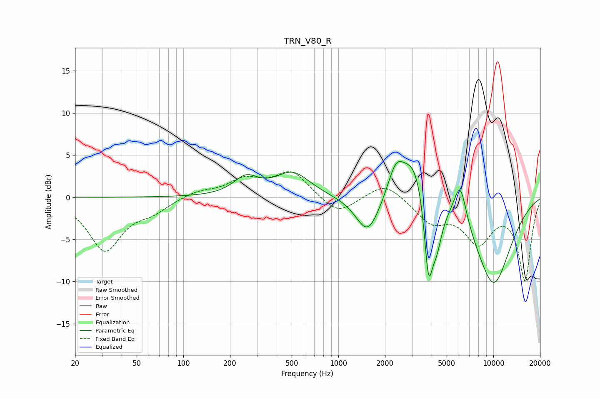

# TRN_V80_R
See [usage instructions](https://github.com/jaakkopasanen/AutoEq#usage) for more options and info.

### Parametric EQs
Apply preamp of -4.3 dB when using parametric equalizer.

|   # | Type    |   Fc (Hz) |    Q |   Gain (dB) |
|-----|---------|-----------|------|-------------|
|   1 | Peaking |       254 | 1.8  |         2.1 |
|   2 | Peaking |       508 | 1.27 |         2.8 |
|   3 | Peaking |      1547 | 1.86 |        -4.5 |
|   4 | Peaking |      2348 | 2.67 |         3.9 |
|   5 | Peaking |      2387 | 1.41 |        -0.9 |
|   6 | Peaking |      3103 | 1.59 |         5.8 |
|   7 | Peaking |      3813 | 5.02 |        -9.5 |
|   8 | Peaking |      4294 | 3.69 |        -4.7 |
|   9 | Peaking |      6114 | 3.32 |         5   |
|  10 | Peaking |     10000 | 0.97 |       -10.4 |

### Fixed Band EQs
When using fixed band (also called graphic) equalizer, apply preamp of **-3.1 dB** (if available) and set gains manually with these parameters.

|   # | Type    |   Fc (Hz) |    Q |   Gain (dB) |
|-----|---------|-----------|------|-------------|
|   1 | Peaking |        31 | 1.41 |        -6.2 |
|   2 | Peaking |        62 | 1.41 |        -1.3 |
|   3 | Peaking |       125 | 1.41 |         0.7 |
|   4 | Peaking |       250 | 1.41 |         1.9 |
|   5 | Peaking |       500 | 1.41 |         3   |
|   6 | Peaking |      1000 | 1.41 |        -2.2 |
|   7 | Peaking |      2000 | 1.41 |         1.9 |
|   8 | Peaking |      4000 | 1.41 |        -2.7 |
|   9 | Peaking |      8000 | 1.41 |        -4.9 |
|  10 | Peaking |     16000 | 1.41 |        -9.7 |

### Graphs

