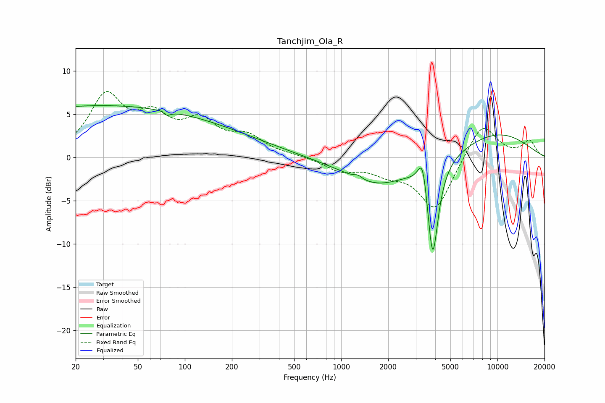

# Tanchjim_Ola_R
See [usage instructions](https://github.com/jaakkopasanen/AutoEq#usage) for more options and info.

### Parametric EQs
Apply preamp of -6.1 dB when using parametric equalizer.

|   # | Type    |   Fc (Hz) |    Q |   Gain (dB) |
|-----|---------|-----------|------|-------------|
|   1 | Peaking |        24 | 0.18 |         5.8 |
|   2 | Peaking |        73 | 5.44 |         3.5 |
|   3 | Peaking |        74 | 5.28 |        -3.9 |
|   4 | Peaking |       192 | 0.42 |         1.5 |
|   5 | Peaking |      1283 | 5.92 |         0.4 |
|   6 | Peaking |      1690 | 0.82 |        -1.9 |
|   7 | Peaking |      1884 | 0.42 |        -1.3 |
|   8 | Peaking |      3325 | 4.86 |         3.9 |
|   9 | Peaking |      3853 | 4.02 |       -11.6 |
|  10 | Peaking |      9653 | 0.5  |         2.9 |

### Fixed Band EQs
When using fixed band (also called graphic) equalizer, apply preamp of **-7.7 dB** (if available) and set gains manually with these parameters.

|   # | Type    |   Fc (Hz) |    Q |   Gain (dB) |
|-----|---------|-----------|------|-------------|
|   1 | Peaking |        31 | 1.41 |         6.8 |
|   2 | Peaking |        62 | 1.41 |         3.8 |
|   3 | Peaking |       125 | 1.41 |         3.6 |
|   4 | Peaking |       250 | 1.41 |         2.1 |
|   5 | Peaking |       500 | 1.41 |         0.2 |
|   6 | Peaking |      1000 | 1.41 |        -1.4 |
|   7 | Peaking |      2000 | 1.41 |        -1.4 |
|   8 | Peaking |      4000 | 1.41 |        -6   |
|   9 | Peaking |      8000 | 1.41 |         4.2 |
|  10 | Peaking |     16000 | 1.41 |         1.9 |

### Graphs

