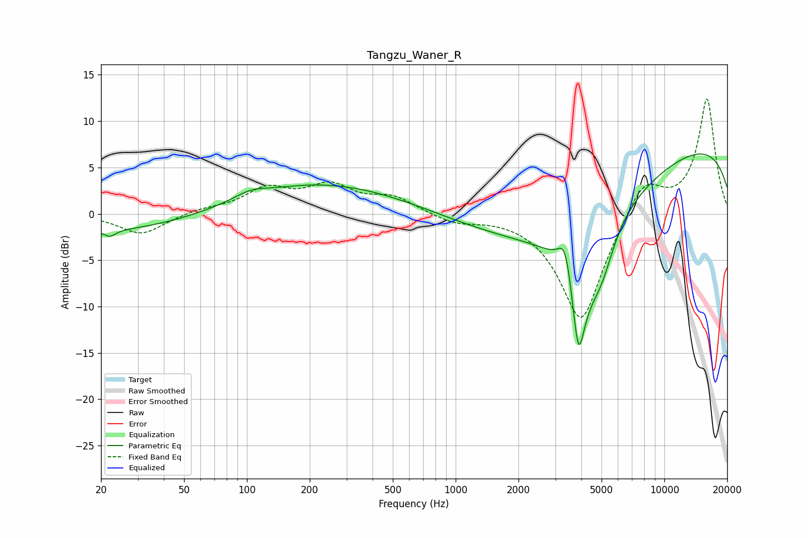

# Tangzu_Waner_R
See [usage instructions](https://github.com/jaakkopasanen/AutoEq#usage) for more options and info.

### Parametric EQs
Apply preamp of -6.5 dB when using parametric equalizer.

|   # | Type    |   Fc (Hz) |    Q |   Gain (dB) |
|-----|---------|-----------|------|-------------|
|   1 | Peaking |        21 | 0.23 |        -2.1 |
|   2 | Peaking |        22 | 5.38 |        -0.7 |
|   3 | Peaking |       104 | 1.98 |         0.7 |
|   4 | Peaking |       204 | 0.32 |         3.5 |
|   5 | Peaking |      3366 | 3.97 |         4.9 |
|   6 | Peaking |      3454 | 0.37 |        -7.4 |
|   7 | Peaking |      3895 | 3.35 |       -16.3 |
|   8 | Peaking |      3946 | 5.09 |         2.8 |
|   9 | Peaking |      4977 | 2.18 |        -4.4 |
|  10 | Peaking |     10000 | 0.18 |         8.3 |

### Fixed Band EQs
When using fixed band (also called graphic) equalizer, apply preamp of **-12.5 dB** (if available) and set gains manually with these parameters.

|   # | Type    |   Fc (Hz) |    Q |   Gain (dB) |
|-----|---------|-----------|------|-------------|
|   1 | Peaking |        31 | 1.41 |        -2.2 |
|   2 | Peaking |        62 | 1.41 |         0.5 |
|   3 | Peaking |       125 | 1.41 |         2.5 |
|   4 | Peaking |       250 | 1.41 |         2.8 |
|   5 | Peaking |       500 | 1.41 |         1.7 |
|   6 | Peaking |      1000 | 1.41 |        -0.9 |
|   7 | Peaking |      2000 | 1.41 |         0   |
|   8 | Peaking |      4000 | 1.41 |       -11.9 |
|   9 | Peaking |      8000 | 1.41 |         4.1 |
|  10 | Peaking |     16000 | 1.41 |        12.4 |

### Graphs

