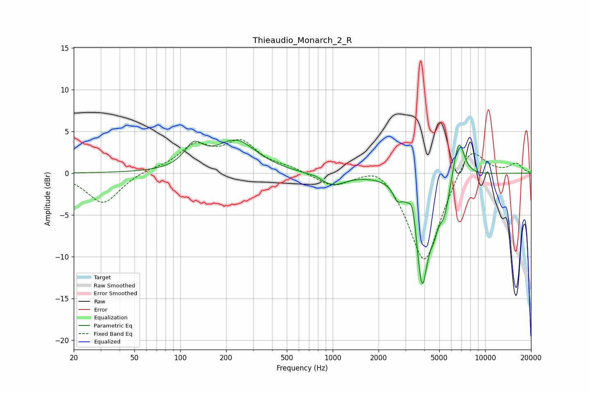

# Thieaudio_Monarch_2_R
See [usage instructions](https://github.com/jaakkopasanen/AutoEq#usage) for more options and info.

### Parametric EQs
Apply preamp of -4.0 dB when using parametric equalizer.

|   # | Type    |   Fc (Hz) |    Q |   Gain (dB) |
|-----|---------|-----------|------|-------------|
|   1 | Peaking |       123 | 2.34 |         2.6 |
|   2 | Peaking |       232 | 1.06 |         3.7 |
|   3 | Peaking |       773 | 4.34 |         0.2 |
|   4 | Peaking |       993 | 1.63 |        -1.5 |
|   5 | Peaking |      2654 | 5.24 |        -1.4 |
|   6 | Peaking |      3354 | 6    |         2.9 |
|   7 | Peaking |      3857 | 3.23 |       -13.2 |
|   8 | Peaking |      4607 | 5.35 |        -2.1 |
|   9 | Peaking |      5404 | 3.73 |        -3.6 |
|  10 | Peaking |      6701 | 3.6  |         5.2 |

### Fixed Band EQs
When using fixed band (also called graphic) equalizer, apply preamp of **-4.1 dB** (if available) and set gains manually with these parameters.

|   # | Type    |   Fc (Hz) |    Q |   Gain (dB) |
|-----|---------|-----------|------|-------------|
|   1 | Peaking |        31 | 1.41 |        -3.7 |
|   2 | Peaking |        62 | 1.41 |         0.4 |
|   3 | Peaking |       125 | 1.41 |         3   |
|   4 | Peaking |       250 | 1.41 |         3.4 |
|   5 | Peaking |       500 | 1.41 |         0.5 |
|   6 | Peaking |      1000 | 1.41 |        -1.5 |
|   7 | Peaking |      2000 | 1.41 |         1.7 |
|   8 | Peaking |      4000 | 1.41 |       -11.1 |
|   9 | Peaking |      8000 | 1.41 |         3.9 |
|  10 | Peaking |     16000 | 1.41 |         1.1 |

### Graphs

