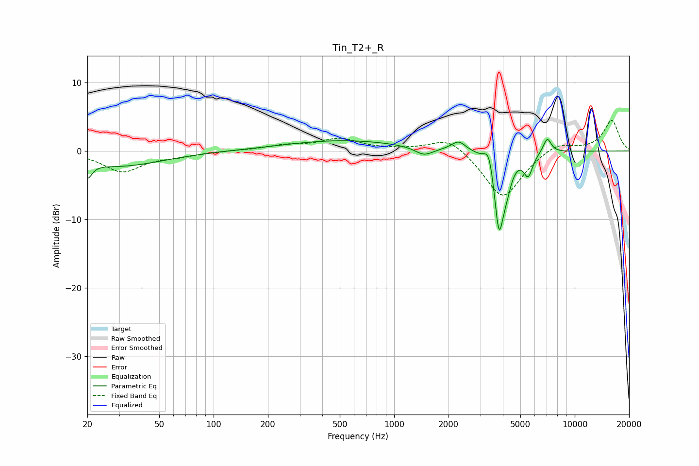

# Tin_T2+_R
See [usage instructions](https://github.com/jaakkopasanen/AutoEq#usage) for more options and info.

### Parametric EQs
Apply preamp of -1.8 dB when using parametric equalizer.

|   # | Type    |   Fc (Hz) |    Q |   Gain (dB) |
|-----|---------|-----------|------|-------------|
|   1 | Peaking |        20 | 5.74 |        -2.2 |
|   2 | Peaking |        30 | 0.59 |        -2.2 |
|   3 | Peaking |       524 | 0.44 |         1.5 |
|   4 | Peaking |      1464 | 2.83 |        -1.2 |
|   5 | Peaking |      2275 | 3.59 |         1.4 |
|   6 | Peaking |      3351 | 5.62 |         3   |
|   7 | Peaking |      3805 | 5.17 |       -11.2 |
|   8 | Peaking |      4201 | 4.91 |        -2.6 |
|   9 | Peaking |      5523 | 5.69 |        -3.1 |
|  10 | Peaking |      7039 | 6    |         2.2 |

### Fixed Band EQs
When using fixed band (also called graphic) equalizer, apply preamp of **-4.6 dB** (if available) and set gains manually with these parameters.

|   # | Type    |   Fc (Hz) |    Q |   Gain (dB) |
|-----|---------|-----------|------|-------------|
|   1 | Peaking |        31 | 1.41 |        -3   |
|   2 | Peaking |        62 | 1.41 |        -0.6 |
|   3 | Peaking |       125 | 1.41 |         0.1 |
|   4 | Peaking |       250 | 1.41 |         0.7 |
|   5 | Peaking |       500 | 1.41 |         1.7 |
|   6 | Peaking |      1000 | 1.41 |         0.1 |
|   7 | Peaking |      2000 | 1.41 |         2.3 |
|   8 | Peaking |      4000 | 1.41 |        -7.1 |
|   9 | Peaking |      8000 | 1.41 |         1.4 |
|  10 | Peaking |     16000 | 1.41 |         4.5 |

### Graphs

