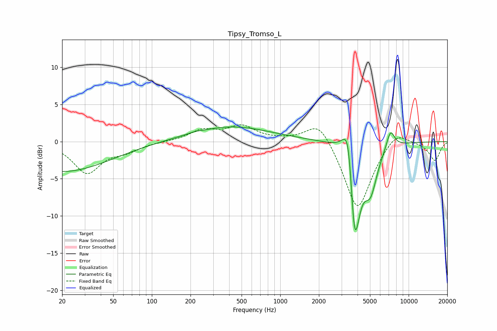

# Tipsy_Tromso_L
See [usage instructions](https://github.com/jaakkopasanen/AutoEq#usage) for more options and info.

### Parametric EQs
Apply preamp of -2.1 dB when using parametric equalizer.

|   # | Type    |   Fc (Hz) |    Q |   Gain (dB) |
|-----|---------|-----------|------|-------------|
|   1 | Peaking |        20 | 0.38 |        -4.1 |
|   2 | Peaking |       214 | 3.33 |         0.1 |
|   3 | Peaking |       411 | 0.49 |         1.7 |
|   4 | Peaking |       452 | 0.28 |         0.4 |
|   5 | Peaking |      3399 | 3.89 |         4.9 |
|   6 | Peaking |      3423 | 2.16 |         3   |
|   7 | Peaking |      3752 | 6    |        -4.3 |
|   8 | Peaking |      3857 | 2.87 |       -11.3 |
|   9 | Peaking |      5049 | 2.66 |        -5.4 |
|  10 | Peaking |      7223 | 4.21 |         2.5 |

### Fixed Band EQs
When using fixed band (also called graphic) equalizer, apply preamp of **-2.4 dB** (if available) and set gains manually with these parameters.

|   # | Type    |   Fc (Hz) |    Q |   Gain (dB) |
|-----|---------|-----------|------|-------------|
|   1 | Peaking |        31 | 1.41 |        -4.1 |
|   2 | Peaking |        62 | 1.41 |        -1.1 |
|   3 | Peaking |       125 | 1.41 |         0   |
|   4 | Peaking |       250 | 1.41 |         1.4 |
|   5 | Peaking |       500 | 1.41 |         2   |
|   6 | Peaking |      1000 | 1.41 |         0.2 |
|   7 | Peaking |      2000 | 1.41 |         3.2 |
|   8 | Peaking |      4000 | 1.41 |        -9.4 |
|   9 | Peaking |      8000 | 1.41 |         1.9 |
|  10 | Peaking |     16000 | 1.41 |        -2.5 |

### Graphs

